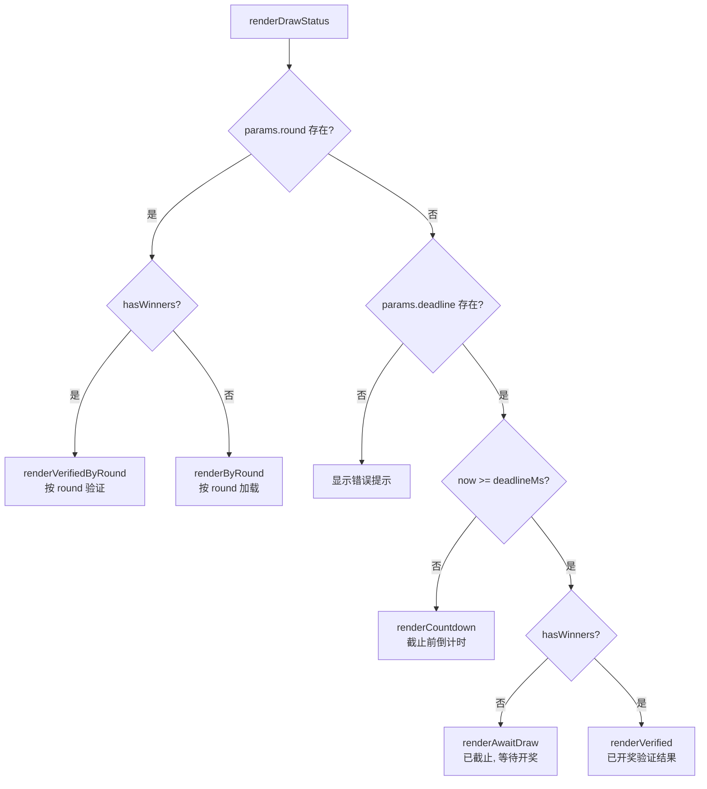

# SPA 路由与页面三态

一个抽奖链接被分享出去后，等待的时间越长，能承载的状态就越多样——截止前、已截止未开奖、已开奖，三种状态共用同一个 URL。drand-draw 通过基于 hash 的 SPA 路由，在单个 HTML 文件内完成了所有状态的分发和切换。

---

## 路由架构：一个函数的分发逻辑

整个前端路由的核心是 `render()` 函数，它不依赖任何第三方路由库。

### 渲染入口

`render()` 在页面加载和 hash 变化时被调用：

```javascript
render()

window.addEventListener('hashchange', render)
window.addEventListener('drand-refresh', render)
```

[来源](src/main.js#L98-L100)

`hashchange` 是浏览器原生事件，用户点击浏览器的前进/后退、手动修改 URL hash 或通过 `location.hash = '...'` 赋值时触发。`drand-refresh` 是自定义事件，下文会展开。

### hash 分发流程

`render()` 内部读取 `location.hash`，去掉前导 `#`，然后按优先级判断路径：

| Hash 路径 | 路由目标 | 渲染函数 |
|---|---|---|
| `#/create` | 发起抽奖页 | `renderCreateDraw()` |
| `#/verify` 或 `#/verify/短码` | 手动验证页 | `renderManualVerify()` 或 `renderDrawStatus()` |
| `#/guide` | 使用指南页 | `renderGuide()` |
| `#/?chain=...&deadline=...&n=...` | 抽奖状态页（核心场景） | `renderDrawStatus()` |
| 空或未知 | 回退到手动验证页 | `renderManualVerify()` |

[来源](src/main.js#L12-L31)

关键判断逻辑在几行之内完成：

```javascript
const hash = location.hash.slice(1) || ''
const params = hashToParams(hash)
```

`hashToParams()` 负责将 hash 解析为结构化的参数对象。它支持两种输入格式：URL query 格式（`?chain=quicknet&deadline=...`）和短码格式（`q-...`），分别对应两种分享方式。详见 [理解 URL 与短码格式](理解-url-与短码格式.md)。

[来源](src/encode.js#L34-L65)

### Tab 导航

顶部的三个 tab 按钮（发起/验证/指南）不通过 `a` 标签而是通过 JavaScript 修改 `location.hash` 来实现导航：

```javascript
btn.addEventListener('click', () => {
  const tab = btn.dataset.tab
  if (tab === 'create') location.hash = '#/create'
  else if (tab === 'verify') location.hash = '#/verify'
  else if (tab === 'guide') location.hash = '#/guide'
})
```

[来源](src/main.js#L51-L57)

修改 `location.hash` 会自动触发 `hashchange` 事件，从而调用 `render()` 完成重新渲染。

---

## 页面三态：同一 URL 的三种面孔

`renderDrawStatus()` 是系统中最重要的渲染函数——**一个抽奖链接在不同时间点会展示完全不同的界面，但 URL 从未改变**。它根据三个变量做分支：`deadline` 是否已过、`winners` 是否存在且非空。

[来源](src/components/DrawStatus.js#L16-L53)



### 状态一：截止前——倒计时

当 `now < deadlineMs` 且没有 winners 时，展示倒计时界面。

`renderCountdown()` 计算剩余时间并渲染模板：

```javascript
const remaining = Math.max(0, deadlineMs - Date.now())
const days = Math.floor(remaining / 86400000)
const hours = Math.floor((remaining % 86400000) / 3600000)
const mins = Math.floor((remaining % 3600000) / 60000)
const secs = Math.floor((remaining % 60000) / 1000)
```

[来源](src/components/DrawStatus.js#L55-L59)

`startCountdown()` 启动一个 `setInterval` 每秒更新 DOM 中的倒计时显示。当剩余时间归零时，它**不清除自身后重新渲染**，而是通过一个自定义事件通知路由层：

```javascript
if (remaining <= 0) {
  clearInterval(window._countdownInterval)
  window.dispatchEvent(new CustomEvent('drand-refresh'))
  return
}
```

[来源](src/components/DrawStatus.js#L90-L98)

### 状态二：已截止未开奖——等待抽奖

当 `now >= deadlineMs` 但没有 winners 时，展示一个包含"开奖"按钮的等待界面。

用户点击按钮后，`renderAwaitDraw()` 执行以下流程：

1. 计算预期 round：`Math.floor((deadline - genesisTime) / period) + 1`
2. 调用 `fetchBeacon()` 从 drand 网络获取随机信标（含 5 次重试）
3. 用 `computeWinners()` 计算中奖者
4. 生成包含 winners 的新参数对象，通过 `paramsToHash()` 和 `encodeShortCode()` 生成可分享的链接和短码
5. 用 `history.replaceState()` 更新当前 URL，**不触发 hashchange 事件**，因此页面不会闪烁式重新渲染
6. 在结果区域渲染中奖名单和复制按钮

```javascript
history.replaceState(null, '', '#' + url)
drawBtn.remove()
```

[来源](src/components/DrawStatus.js#L174-L175)

这里的设计意图很明显：开奖后页面内容直接展开在当前容器内，而不是触发一次完整的 `render()` 重新构建整个 DOM。

### 状态三：已开奖——验证结果

当 `now >= deadlineMs` 且 `winners` 已存在时，展示验证结果界面。

`renderVerified()` 渲染静态信息（链、round、deadline、N、prizes、claimed winners），然后异步调用 `performVerification()`：

1. 通过 `fetchWithRetry()` 获取 drand 信标（最多 5 次重试，间隔 2 秒）
2. 用 `computeWinners()` 计算理论中奖者
3. 对比理论结果与 claim 的结果
4. 匹配则显示绿色勾 + 成功信息；不匹配则显示红色叉 + 双方对比

[来源](src/components/DrawStatus.js#L196-L241)

---

## `drand-refresh` 事件：状态转换的信号

这个自定义事件的触发时机只有一处：**倒计时归零时**。

"为什么要用事件而不是直接调用 `render()`？"这是一个架构上的解耦考量：

- `startCountdown()` 在 `DrawStatus.js` 中，它不应该直接依赖 `main.js` 的 `render()` 函数
- 通过 `window.dispatchEvent(new CustomEvent('drand-refresh'))`，任何监听了该事件的模块都可以响应
- 当前只有一个监听者（`main.js` 中的 `render`），但未来可以扩展

[来源](src/components/DrawStatus.js#L93-L96)

与 `hashchange` 对比：

| 事件 | 触发方式 | 用途 |
|---|---|---|
| `hashchange` | 用户操作（点击 tab、前进/后退）或 `location.hash` 赋值 | 页面/功能切换 |
| `drand-refresh` | 倒计时归零时由代码触发 | 同一页面的状态刷新（从倒计时态切换到等待态） |

倒计时期间用户可能停留在页面上，也可能不在。如果用户回来时倒计时早已归零，`render()` 在首次渲染时就会直接走 `isExpired` 分支，不会触发 `drand-refresh`。这个事件仅服务于**正在页面上观看倒计时**的用户。

---

## 组件通信方式：事件驱动的解耦设计

整个前端没有引入任何状态管理库（如 Vuex/Pinia 或 Redux），组件间的通信完全依赖两种机制：

### DOM 事件

组件通过容器 `container` 参数渲染，然后在渲染后的 DOM 上绑定事件监听：

- **Tab 导航**：`app.querySelectorAll('.tab-btn')` 绑定 click
- **语言切换**：`app.querySelector('#lang-switch')` 绑定 click，切换后调用 `render()`
- **开奖按钮**：`container.querySelector('#do-draw-btn')` 绑定 click
- **验证提交**：`container.querySelector('#verify-submit')` 绑定 click
- **复制按钮**：`container.querySelectorAll('.copy-btn')` 绑定 click
- **回车提交**：`container.querySelector('#verify-input')` 监听 `keydown` 事件

[来源](src/main.js#L51-L65)

### 全局 window 事件

两个全局事件作为组件间的"消息总线"：

- `hashchange`：路由层接收，触发整体重新渲染
- `drand-refresh`：倒计时子组件发送，路由层接收，触发状态刷新

这种设计意味着每个组件可以独立测试：传入一个 DOM 容器，组件在其中渲染自己的界面和逻辑，不依赖外部状态对象。这也是为什么 `renderDrawStatus()` 能在三个不同的调用场景中正常工作——手动验证时的内嵌渲染、路由层的主渲染、以及 `verify-result` div 中的子渲染。

[来源](src/components/DrawStatus.js#L240-L241)

---

## 路由路径总结

```
#/create          → 发起抽奖 (CreateDraw)
#/verify          → 手动输入验证 (ManualVerify)
#/verify/短码     → 解析短码后渲染状态 (DrawStatus)
#/guide           → 使用指南 (Guide)
#/?key=value...   → 根据 deadline/winners 决定三态 (DrawStatus)
(空)              → 默认回退到手动验证 (ManualVerify)
```

所有路由路径都收敛到 `render()` 这一个入口。`hashToParams()` 作为解析层，将 hash 字符串统一转为参数对象供下游消费。页面三态的切换不依赖 URL 变化，而是依赖数据状态的变化，由 `drand-refresh` 事件或用户点击触发。

---

## 推荐阅读

- [理解 URL 与短码格式](理解-url-与短码格式.md) —— hash 参数的两种编码方式
- [核心抽奖算法详解](核心抽奖算法详解.md) —— `computeWinners` 的数学原理
- [drand HTTP API 集成](drand-http-api-集成.md) —— `fetchBeacon` 的多 Relay 容错策略
- [国际化实现](国际化实现.md) —— 语言切换触发的全局重新渲染