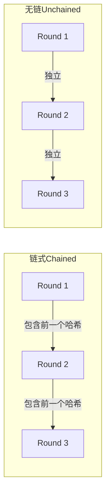
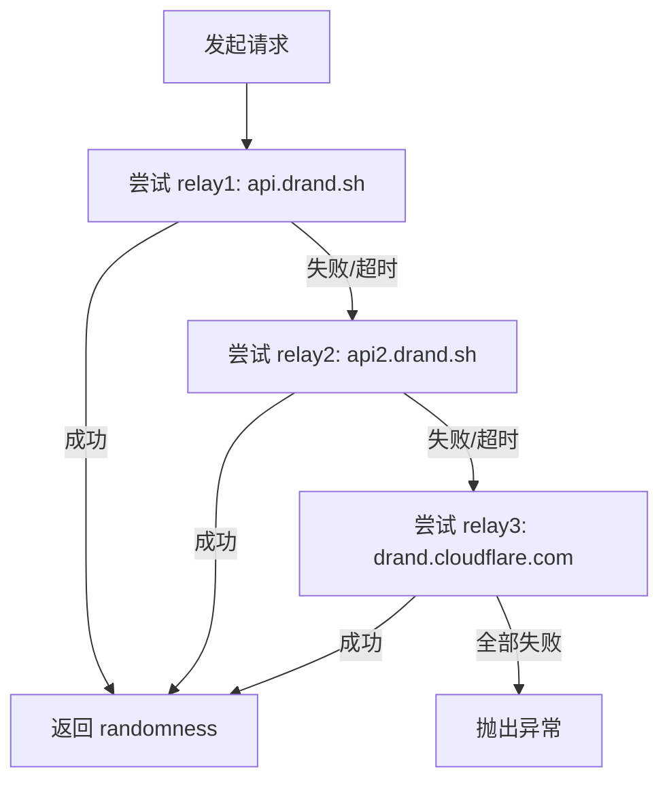

# 理解 drand 去中心化随机数

## 什么是 drand

**drand**（Distributed Randomness Beacon）是一个由 **League of Entropy** 运行的**去中心化随机信标网络**。超过 15 个独立机构——包括 Cloudflare、Protocol Labs、Ethereum Foundation、University of Chile 等——各持一份密钥分片，只有达到阈值数量的节点共同签名才能产生一个随机的信标值。

这意味着：没有任何一个实体可以预测或操控随机数。drand 的输出是公开的、可验证的、**不可预测的**。

> League of Entropy 的完整成员列表见 [drand 官网](https://drand.love)，中文介绍参考 [概览](概览.md)。

[来源](src/chains.js#L1-L32)

---

## 三条链的参数对比

drand 维护多条并行链，本项目支持其中的三条。它们的核心差异在于**出块间隔（period）** 和 **签名方案（scheme）**。

| 参数 | quicknet | default | evmnet |
|------|----------|---------|--------|
| **chainHash** | `52db9ba...c84e971` | `8990e7a...51b2ce` | `04f1e90...66ec8c3` |
| **genesisTime** | 1692803367（2023-08-23） | 1595431050（2020-07-22） | 1727521075（2024-09-28） |
| **period（秒）** | **3** | **30** | **3** |
| **scheme** | `bls-unchained-g1-rfc9380` | `pedersen-bls-chained` | `bls-bn254-unchained-on-g1` |
| **publicKey** | 96 字节 | 48 字节 | 128 字节 |
| **relays** | 3 个 | 3 个 | 3 个 |

三条关键差异：

- **quicknet**（推荐）：3 秒一轮，采用最新的 BLS 无链（unchained）签名方案，延迟最低，适合抽奖场景。
- **default**：30 秒一轮，采用链式（chained）签名——每个信标值包含前一个的哈希，但出块慢，抽奖后需等最多 30 秒才能开奖。
- **evmnet**：同样 3 秒一轮，但使用 BN254 椭圆曲线，专为以太坊生态兼容设计。

> 短码中的链前缀映射为 `q`/`d`/`e`，详见 [短码设计与编解码](短码设计与编解码.md)。

[来源](src/chains.js#L1-L32)

---

## 链式 vs 无链签名

理解 default 链的 `pedersen-bls-chained` 与其他两条链的 `unchained` 之区别：



**链式**的每个信标值都链接着前一个，形成一条验证链，但代价是如果某一轮丢失，后续所有轮都无法独立验证。**无链**的每个信标值独立可验证，容错性更好，这也是 quicknet 和 evmnet 采用它的原因。

[来源](src/chains.js#L8-L11)

---

## HTTP API 调用方式

drand 网络通过公开的 HTTP API 提供随机数查询。请求格式如下：

```
GET {relay}/{chain_hash}/public/{round}
```

**参数说明：**

| 参数 | 含义 | 示例 |
|------|------|------|
| `relay` | 公共中继节点 | `https://api.drand.sh` |
| `chain_hash` | 链的唯一标识 | `52db9ba70e0cc0f6eaf7803dd07447a1f5477735fd3f661792ba94600c84e971` |
| `round` | 轮次号（从 1 开始递增） | `7398878` |

**响应 JSON 结构：**

```json
{
  "round": 7398878,
  "randomness": "a3f25c8d1e7b...",
  "signature": "92daf574..."
}
```

- **`randomness`**：64 字符的十六进制字符串，即抽奖算法使用的种子来源。
- **`signature`**：BLS 多签签名，可通过 chain 的 `publicKey` 验证该 randomness 是否确实由 League of Entropy 的阈值节点生成。

> randomness 如何用于中奖计算，见 [核心抽奖算法详解](核心抽奖算法详解.md)。

[来源](src/api.js#L1-L18)

---

## 多 Relay 容错机制

drand 网络不依赖单一中继节点。本项目在前端 `api.js` 和后端 CLI `api.py` 中都实现了**顺序回退**机制：



具体实现逻辑（`src/api.js`）：

1. 从 `CHAINS[chainId].relays` 获取该链的 relay 列表（三条链都配置了相同的三个 relay）。
2. 按顺序逐个尝试，超时时间 8 秒（`AbortSignal.timeout(8000)`）。
3. 如果某个 relay 返回 HTTP 200，立即解析 JSON 并返回 `{ round, randomness, signature }`。
4. 如果失败（网络错误或非 200 状态码），`continue` 到下一个 relay。
5. 所有 relay 都失败则抛出 `"All relays failed"` 错误。

Python CLI 版（`cli/drand_draw/api.py`）采用同样的策略，超时时间为 10 秒。

这意味着：即使 `api.drand.sh` 宕机，系统会自动切换到 `api2.drand.sh`，再不行就切换到 `drand.cloudflare.com`。只要至少一个公共 relay 在线，抽奖就能正常进行。

> 上游调用者如何处理这个异常，见 [drand HTTP API 集成](drand-http-api-集成.md)。

[来源](src/api.js#L3-L18)
[来源](cli/drand_draw/api.py#L10-L25)

---

## Round 的计算公式

drand 的 round 编号是确定性的，由截止时间（deadline）和链的创世参数唯一决定：

```
round = floor((deadline - genesisTime) / period) + 1
```

例如，quicknet 链上，deadline = 1715000000：

```
round = floor((1715000000 - 1692803367) / 3) + 1
      = floor(22226633 / 3) + 1
      = 7408877 + 1
      = 7408878
```

这个计算在抽奖发起时就已完成，并锁定在抽奖链接/短码中。任何人无法选择"有利的"round，因为 deadline 是博主事先声明的。

[来源](ALGORITHM.md#L28-L35)

---

## 下一步

- 了解 randomness 如何转化为具体的中奖编号 → [核心抽奖算法详解](核心抽奖算法详解.md)
- 查看 API 封装的完整实现 → [drand HTTP API 集成](drand-http-api-集成.md)
- 理解这个机制的信任模型和攻击面 → [抽奖的安全模型](抽奖的安全模型.md)
- 上手实操一次完整流程 → [快速开始](快速开始.md)