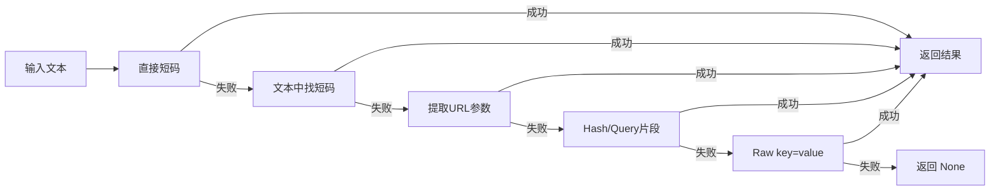

# CLI 工具安装与基础用法

`drand-draw` 是一个 Python 命令行工具，实现了与网页版完全一致的抽奖算法。它适合批量验证、自动化集成、以及在没有图形界面的环境中使用。五条命令覆盖了从参数编码到结果验证的完整链路。

---

## 安装

项目通过 `pyproject.toml` 配置为标准的 Python 包，入口点注册为 `drand-draw` 控制台脚本：

```toml
[project]
name = "drand-draw"
version = "1.0.0"
requires-python = ">=3.10"

[project.scripts]
drand-draw = "drand_draw.__main__:main"
```

两条安装/运行路径：

**方式一：安装后全局使用**

```bash
pip install .
drand-draw verify --chain quicknet --round 7398878 --n 100 --prizes 1,3 --winners 42,15,78,33
```

**方式二：直接调用模块（不污染环境）**

```bash
python -m drand_draw verify --chain quicknet --round 7398878 --n 100 --prizes 1,3 --winners 42,15,78,33
```

两种方式行为完全一致，区别仅在于是否将 `drand-draw` 加入 PATH。

[来源](cli/pyproject.toml#L1-L10) | [来源](cli/drand_draw/__main__.py#L155-L159)

---

## 五条命令精解

所有子命令共享全局参数解析器，通过 `argparse` 的 `add_subparsers` 分发到各自的处理函数。[来源](cli/drand_draw/__main__.py#L134-L155)

### `verify` — 验证抽奖结果

**功能**：给定 round 编号和声明的中奖编号，从 drand 网络获取随机数，重新计算中奖名单并逐一比对。

**参数**：

| 参数 | 必填 | 类型 | 说明 |
|------|------|------|------|
| `--chain` | 是 | 枚举 | `quicknet` / `default` / `evmnet` |
| `--round` | 是 | int | drand round 编号 |
| `--n` | 是 | int | 参与人数 |
| `--prizes` | 是 | string | 各奖项人数，逗号分隔，如 `1,3` |
| `--winners` | 是 | string | 中奖编号，逗号分隔，如 `42,15,78,33` |

**输出示例**：

```
Round: #7398878
Randomness: a3f25c8d1e7b...
Prize Tier 1 (1 winner): #42  [PASS]
Prize Tier 2 (3 winners): #15, #78, #33  [PASS]
Verification: PASSED
```

验证逻辑：调用 `api.fetch_randomness` 从 drand relay 获取随机数，调用 `lottery.compute_winners` 计算理论结果，逐层比对。一旦某层不匹配，该层标记为 `[FAIL]`，最终输出 `FAILED`。[来源](cli/drand_draw/__main__.py#L22-L55)

---

### `compute` — 计算开奖结果

**功能**：给定截止时间戳和参与人数，自动计算对应 drand round，获取随机数后算出中奖编号。博主开奖时使用此命令。

**参数**：

| 参数 | 必填 | 类型 | 说明 |
|------|------|------|------|
| `--chain` | 是 | 枚举 | `quicknet` / `default` / `evmnet` |
| `--deadline` | 是 | int | 截止 Unix 时间戳（秒） |
| `--n` | 是 | int | 参与人数 |
| `--prizes` | 是 | string | 各奖项人数，逗号分隔 |

**输出示例**：

```
Deadline: 2026-05-06 12:53:20 UTC
Round: #7398878
Randomness: a3f25c8d1e7b...
Prize Tier 1 (1 winner): #42
Prize Tier 2 (3 winners): #15, #78, #43
```

核心流程：先调 `lottery.compute_round(deadline, genesis, period)` 算出 round 编号，再获取随机数，最后计算中奖者。[来源](cli/drand_draw/__main__.py#L57-L83)

关于 round 计算与 winner 派生的完整算法，见 [抽奖核心算法](抽奖核心算法.md)。

---

### `encode` — 编码短码

**功能**：将抽奖参数编码为紧凑的短码字符串，用于在社交媒体分享，避免外链被屏蔽。

**参数**：

| 参数 | 必填 | 类型 | 说明 |
|------|------|------|------|
| `--chain` | 是 | 枚举 | `quicknet` / `default` / `evmnet` |
| `--deadline` | 是 | int | 截止 Unix 时间戳 |
| `--n` | 是 | int | 参与人数 |
| `--prizes` | 否 | string | 各奖项人数，逗号分隔 |
| `--winners` | 否 | string | 中奖编号，逗号分隔 |

**输出示例**：

```
q-66364280-2s-1,3
```

编码格式：`{chain_prefix}-{deadline_hex}-{n_base36}[-{prizes_base36}[-{winners_base36}]]`。Chain 前缀 `q` 对应 quicknet，`d` 对应 default，`e` 对应 evmnet。deadline 用十六进制编码，N 和各奖项数字用 base36 编码。[来源](cli/drand_draw/encode.py#L43-L52)

短码格式的完整规范见 [短码编解码规范](短码编解码规范.md)。

---

### `decode` — 解码短码

**功能**：将短码反解析为人类可读的抽奖参数。

**参数**：

| 参数 | 必填 | 类型 | 说明 |
|------|------|------|------|
| `code` | 是 | string | 短码字符串（位置参数） |

**输出示例**：

```
Chain: quicknet
Deadline: 1715000000 (2026-05-06 12:53:20 UTC)
N: 100
Prizes: 1, 3
Winners: #42, #15, #78
```

解码逻辑是编码的逆过程：切分 `-` 分段，通过 `PREFIX_TO_CHAIN` 字典映射前缀到链名称，对 deadline 十六进制和 N/base36 数字做进制转换。[来源](cli/drand_draw/encode.py#L54-L78)

---

### `parse` — 智能解析

**功能**：从任意格式文本（URL、短码、分享文案）中自动识别并提取抽奖参数。支持从 stdin 读取，方便管道集成。

**参数**：

| 参数 | 必填 | 类型 | 说明 |
|------|------|------|------|
| `text` | 否 | string | 输入文本（位置参数，可选；省略则从 stdin 读） |

**输出示例**：

```
Chain: quicknet
Deadline: 1715000000 (2026-05-06 12:53:20 UTC)
N: 100
Prizes: 1, 3
Winners: #42, #15, #78

→ Pipe to verify: drand-draw verify --chain quicknet --round ??? --n 100 --prizes 1,3 --winners 42,15,78
```

最后一行生成可直接复制粘贴的 `verify` 命令模板，引导用户完成验证。[来源](cli/drand_draw/__main__.py#L108-L131)

---

## 智能解析引擎：`smart_parse`

`smart_parse` 是 `encode.py` 中定义的解析函数，采用 **阶梯式回退策略**，依次尝试五种解析方法，命中即返回。[来源](cli/drand_draw/encode.py#L133-L147)



各步骤解析：

| 步骤 | 函数 | 匹配目标 | 示例输入 |
|------|------|----------|----------|
| 1 | `_try_shortcode` | 直接传入完整短码 | `q-66364280-2s-1,3` |
| 2 | `_find_shortcode_in_text` | 从文本中正则匹配短码模式 `[qde]-[0-9a-f]+-[0-9a-z,]+` | `"抽奖链接 q-66364280-2s-1,3 快来"` |
| 3 | `_extract_url` | 从 URL 的 hash 或 query 中提取 `chain`/`deadline`/`n` 参数 | `https://example.com/#/?chain=quicknet&deadline=1715000000&n=100` |
| 4 | `_try_fragment` | 从纯 hash/query 片段解析参数 | `?chain=quicknet&deadline=1715000000&n=100&prizes=1,3` |
| 5 | `_try_raw` | 最宽松的 key=value 格式 | `chain=quicknet deadline=1715000000 n=100` |

`_try_raw` 是最后的兜底方案——只要文本中包含 `=` 且能解析出 `chain`、`deadline`、`n` 三个关键字段即成功。[来源](cli/drand_draw/encode.py#L117-L131)

---

## 参数对比总表

| 参数 | verify | compute | encode | decode | parse |
|------|--------|---------|--------|--------|-------|
| `--chain` | **必填** | **必填** | **必填** | — | — |
| `--round` | **必填** | — | — | — | — |
| `--deadline` | — | **必填** | **必填** | — | — |
| `--n` | **必填** | **必填** | **必填** | — | — |
| `--prizes` | **必填** | **必填** | 可选 | — | — |
| `--winners` | **必填** | — | 可选 | — | — |
| `code` (位置参数) | — | — | — | **必填** | — |
| `text` (位置参数) | — | — | — | — | 可选 |

`parse` 之所以参数最少，是因为它通过 `smart_parse` 从自由文本中自动推导所有字段——这是 CLI 中最"聪明"的命令。

[来源](cli/drand_draw/__main__.py#L134-L155)

---

## 与网页版的关系

- **算法一致**：`lottery.py` 中的 `compute_round` 和 `compute_winners` 与前端 `src/lottery.js` 使用完全相同的 SHA-256 种子派生和碰撞处理逻辑。[来源](cli/drand_draw/lottery.py#L1-L33)
- **随机数来源一致**：`api.py` 连接相同的 drand relay 节点列表。[来源](cli/drand_draw/api.py#L4-L9)
- **短码编解码一致**：`encode.py` 的 base36 方案与前端的 `src/encode.js` 完全兼容。[来源](cli/drand_draw/encode.py#L8-L21)

这意味着你可以在网页上创建抽奖、复制短码，然后在终端中用 CLI 验证——两边的数字永远吻合。

---

## 下一步

- 了解命令行工具如何打包和发布到 PyPI：参见 [CLI 打包与发布](cli-打包与发布.md)
- 算法的数学原理和测试向量：参见 [抽奖核心算法](抽奖核心算法.md)
- 短码编码的二进制布局和跨平台兼容性：参见 [短码编解码规范](短码编解码规范.md)
- 从博主视角操作完整抽奖流程：参见 [博主操作指南](博主操作指南.md)