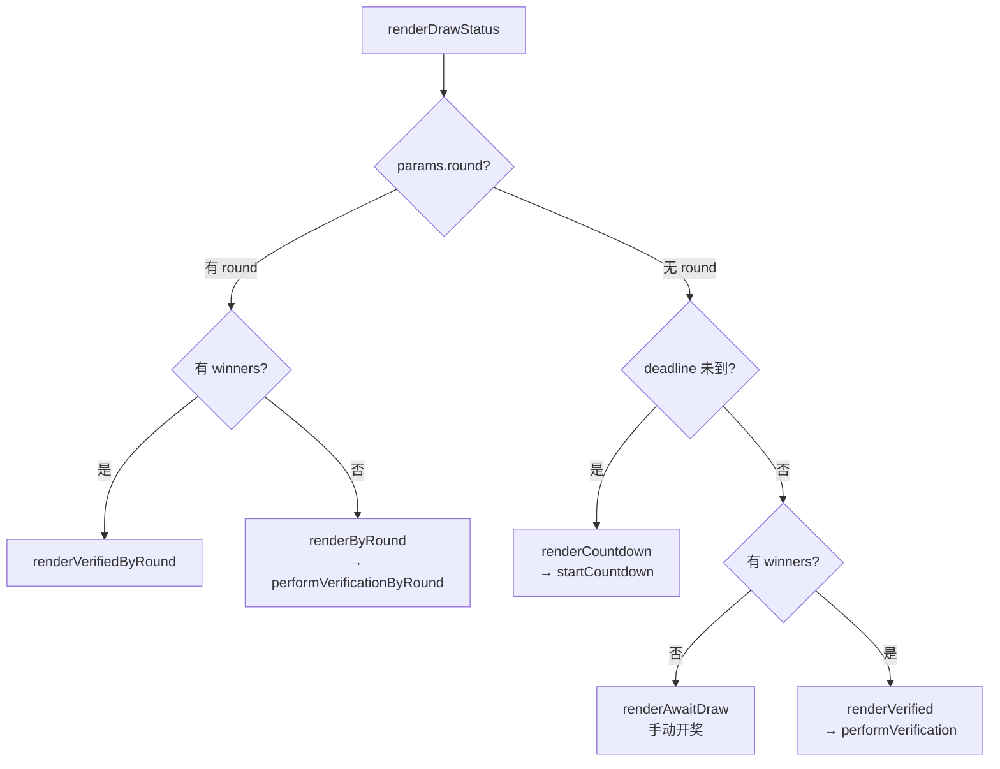

# 三态页面渲染机制

`DrawStatus.js` 是整个前端的核心呈现组件——它接收一组抽奖参数，将其映射为三种互斥的 UI 状态。这个三态模型构成了[系统架构全景](系统架构全景.md)中"纯前端 SPA"的视图层支柱。



## 决策树：三条路径

`renderDrawStatus` 的入口决策逻辑基于两个判别维度：**Round 是否已知** 和 **deadline 是否过期**。实际代码中先检查 `params.round` 的存在性，再检查 `winners` 的有无，形成两条独立的分支主线：

```javascript
// 分支 A：round 已知（用于直接验证模式）
if (params.round) {
  if (hasWinners) renderVerifiedByRound(...)
  else renderByRound(...)
  return
}
// 分支 B：round 未知，基于 deadline
if (!params.deadline) { /* 空状态 */; return }
const isExpired = now >= deadlineMs
if (!isExpired)        renderCountdown + startCountdown
else if (!hasWinners)  renderAwaitDraw
else                   renderVerified
```

[来源](src/components/DrawStatus.js#L36-L56)

**关键洞察**：`params.round` 的显式存在意味着用户进入的是"按 round 验证"模式，不走 deadline 逻辑。这两条主线的渲染归宿相同——最终都调用 `performVerification` 或 `performVerificationByRound`，但中间层 UI（倒计时 vs 开奖按钮 vs 直接验证）完全不同。

## 状态一：Countdown（deadline 未到）

当当前时间早于 deadline 时，渲染倒计时面板并启动每秒一次的定时器。

### 渲染层：`renderCountdown`

函数将剩余时间拆分为天/时/分/秒，写入一个带有 `data-deadline` 属性的 `.countdown-display` 元素。同时计算预计的 drand **round 编号**（使用 `computeRound` 的等价公式），提前告知用户后续将使用哪个 round 的随机信标：

```javascript
const round = Math.floor((params.deadline - chain.genesisTime) / chain.period) + 1
```

[来源](src/components/DrawStatus.js#L58-L60)

面板同时展示链名、参与人数 N、奖项层级和预计 round 号，为用户提供完整的上下文预览。

### 更新层：`startCountdown`

挂载一个 `setInterval`（间隔 1000ms），每次回调找到 `.countdown-display` 元素，用当前时间重新计算差值并更新 `textContent`。当剩余时间归零时（`remaining <= 0`），清除定时器并触发一个自定义事件 `drand-refresh`：

```javascript
window.dispatchEvent(new CustomEvent('drand-refresh'))
```

这个自定义事件在 `main.js` 中被监听，触发 `render()` 函数重新执行整个路由-渲染流程。由于 `location.hash` 未变，`renderDrawStatus` 会被用相同的 `params` 再次调用，但此刻 deadline 已过期，`isExpired` 为 true 且 `hasWinners` 为 false，因此自动转入 **renderAwaitDraw** 状态。

[来源](src/components/DrawStatus.js#L93-L107)

**跨页面一致性保证**：倒计时通过 `window._countdownInterval` 引用缓存，每次调用 `startCountdown` 前会 `clearInterval` 旧定时器，防止在 SPA 的多次渲染中产生重复定时器。

## 状态二：AwaitDraw（已截止，等待开奖）

当 deadline 已过但 `params.winners` 为空时，渲染一个"开奖"按钮。这是三态模型中唯一需要用户主动触发的状态。

### 开奖流程

按钮的 `click` 事件处理器依次执行：

1. **计算 round**：与倒计时阶段相同的公式，确保与 `drand` 网络的 round 对齐
2. **获取信标**：内联的 5 次重试循环（间隔 3 秒），调用 `fetchBeacon` 从 drand 多 relay 获取随机信标
3. **计算中奖者**：调用 `computeWinners(beacon.randomness, n, prizes)`，[抽奖核心算法](抽奖核心算法.md)在此处生效
4. **构建结果参数**：将 winners 合并入原始 params，调用 `paramsToHash` 和 `encodeShortCode` 生成可分享的 URL 和短码
5. **写入浏览器地址栏**：`history.replaceState(null, '', '#' + url)`——这是 hash 路由的关键写入点，页面的 `hashchange` 事件不会因此触发，但用户刷新后可恢复到此结果状态
6. **渲染结果面板**：展示 round 号、randomness、分层中奖者列表，以及三个复制按钮（分享链接、短码、全文）

[来源](src/components/DrawStatus.js#L122-L202)

**错误恢复**：若 fetch 失败，按钮重新启用，错误信息显示在 `#draw-error` 区域，用户可重试。注意这里的重试间隔为 3 秒（而非 verification 中的 2 秒），且用 while 循环直接控制。

## 状态三：Verified（有 winners，直接验证）

当 `params.winners` 存在时——无论是 URL hash 自带还是开奖后刷新页面，渲染验证面板并立即启动自动验证。

### `performVerification` 与 `fetchWithRetry`

验证委托给 `performVerification(container, params, chain, round, prizes, n, claimed)`，其核心是获取 drand 信标后重新计算 winners 并与 `claimed` 比对。网络调用通过 `fetchWithRetry` 包装：

```javascript
async function fetchWithRetry(chain, round, maxRetries = 5) {
  for (let attempt = 0; attempt < maxRetries; attempt++) {
    try {
      return await fetchBeacon(chain, round)
    } catch {
      if (attempt >= maxRetries - 1) throw new Error('Failed to fetch beacon after retries')
      await new Promise(r => setTimeout(r, 2000))
    }
  }
}
```

[来源](src/components/DrawStatus.js#L8-L16)

**重试策略参数**：最多 5 次尝试，每次失败后等待 2 秒。与 `renderAwaitDraw` 中内联的 3 秒间隔不同，这里的 2 秒更保守，因为它被设计为"无人值守的自动验证"场景。超出重试次数后抛出异常，UI 显示 `.alertTriangle` 图标和错误消息。

### 匹配判定

```javascript
const match = computed.length === claimed.length &&
              computed.every((v, i) => v === claimed[i])
```

精确的 **全等比较**：不仅要求获奖者集合一致，还要求顺序一一对应（因为多层奖项依赖 `prizes` 数组的层级顺序）。匹配成功显示绿色盾牌图标 + 分层中奖者列表；失败则显示红叉图标，同时列出"声称的中奖者"和"计算出的中奖者"供人工比对。

[来源](src/components/DrawStatus.js#L242-L244)

## Hash 驱动：跨页面状态保持

三态模型的持久性不依赖任何后端或 `localStorage`，完全通过 URL hash 实现：

```javascript
window.addEventListener('hashchange', render)   // 普通 hash 变化
window.addEventListener('drand-refresh', render) // 倒计时归零事件
```

- **创建抽奖**：用户在 `CreateDraw` 填写参数后，生成如 `#/?chain=quicknet&deadline=1719000000&n=100` 的 hash，页面「跳转」到验证面板，`renderDrawStatus` 自动解析出三个状态中的哪一个应被渲染
- **倒计时归零**：`drand-refresh` 触发 `render()`，在当前 hash 不变的情况下重新执行 `renderDrawStatus`，此刻 deadline 已过期，状态自动推进
- **开奖后**：`history.replaceState` 将 winners 写入 hash，刷新后 `renderDrawStatus` 直接进入 Verified 状态

[来源](src/main.js#L164-L165)

这一机制与[前端路由与状态管理](前端路由与状态管理.md)中描述的 hash 编码体系深度耦合：`paramsToHash` 将结构化参数序列化为 URLSearchParams 格式的 hash，而 `hashToParams` 负责逆解析。

## Round 模式：绕过 deadline 的直接验证

`renderDrawStatus` 还处理一种"元三态"路径：当输入参数显式包含 `params.round` 时（例如通过 `/verify/` 短码路由进入），不依赖 deadline 时间判断，直接基于 round 号获取信标并验证。此模式提供两种子状态：

- **`renderByRound`**：无 winners → 从 drand fetch 信标 → 计算并展示结果
- **`renderVerifiedByRound`**：有 winners → 从 drand fetch 信标 → 比对并展示匹配/不匹配

两者共享同一个 `performVerificationByRound` 函数，其逻辑与 `performVerification` 完全对称，区别在于 round 是显式传入而非从 deadline 推导。

[来源](src/components/DrawStatus.js#L279-L345)

## 错误边界

三态渲染定义了清晰的错误层级：

| 层级 | 条件 | 表现 |
|------|------|------|
| 空参数 | `!params` 或缺少关键字段 | `text-gray-400` 提示 `manualInput` |
| 未知链 | `!CHAINS[params.chain]` | `text-red-400` 显示 "Unknown chain" |
| 倒计时中 | 定时器内的 DOM 丢失 | `clearInterval` 静默退出 |
| 开奖失败 | 5 次重试均失败 | 红色错误信息 + 按钮重新启用 |
| 验证失败 | `fetchWithRetry` 抛出 | `.alertTriangle` 图标 + error message |

[来源](src/components/DrawStatus.js#L20-L31)

## 总结

三态页面渲染机制以 `renderDrawStatus` 为单一入口，通过 deadline 时间和 winners 存在性这两个正交维度，将用户场景划分为三个互斥状态。倒计时阶段的 `drand-refresh` 事件提供了状态自推进的"时间门"；hash 驱动确保了状态的完全可恢复性，无需任何服务器端 session。`fetchWithRetry` 的 5 次重试 + 2 秒间隔作为网络不可靠场景的最后屏障，保证验证过程的健壮性。