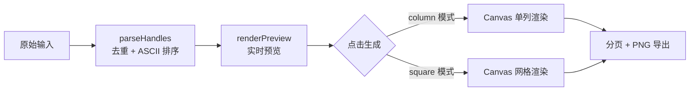
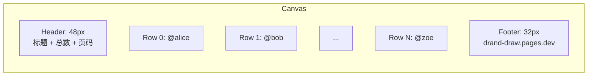
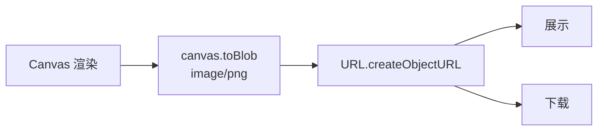

以下是 `src/components/SortTool.js` 的完整架构分析。

---

## 核心流程

候选列表排序工具内嵌于[博主操作指南](博主操作指南.md)中的创建抽奖页面，是一个纯客户端工具，无需任何网络请求。其工作流水线分三步：



[来源](src/components/SortTool.js#L1-L4)

---

## 1. parseHandles：输入清洗、去重与排序

这是整个工具的入口函数，负责将用户粘贴的任意格式文本转化为规范的、排序后的参与者数组。

### 处理流程

| 步骤 | 正则 / 操作 | 示例输入 → 输出 |
|------|------------|----------------|
| 分隔符归一 | `[,，、\s]+` → `" "` | `"@alice,@bob @charlie"` → `"@alice @bob @charlie"` |
| 移除 @ | `replace(/@/g, '')` | `"@alice"` → `"alice"` |
| 去重 | `new Set(...)` | 重复的 handle 只保留一个 |
| 过滤空串 | `filter(h => h.length > 0)` | 连续空白产生的空 entry 被丢弃 |
| ASCII 排序 | `sort((a,b) => a < b ? -1 : a > b ? 1 : 0)` | 按 Unicode 码点升序排列 |

[来源](src/components/SortTool.js#L172-L182)

### 排序细节

比较函数使用 JavaScript 原生的 `<` / `>` 运算符，对 ASCII 字符集而言等价于字典序。对于纯英文用户名（`a-z`、`0-9`、`_`），排序结果符合预期。注意 **不涉及本地化语言排序**（如 `localeCompare`），所以中文用户名会按 Unicode 码点排列。

```js
handles.sort((a, b) => a < b ? -1 : a > b ? 1 : 0)
```

[来源](src/components/SortTool.js#L180)

### 输入示例

```
@alice @bob @charlie   @diana
@alice, @eve、@frank
@bob
```

处理后得到 `["alice", "bob", "charlie", "diana", "eve", "frank"]` — 注意 `@alice` 和 `@bob` 各出现两次，但输出中各只有一个。

---

## 2. renderPreview：实时预览

用户每次输入时触发 `input` 事件，调用 `renderPreview` 在灰色预览区显示排序结果。

```js
function renderPreview() {
  const items = currentHandles.map((h, i) =>
    showNumbers ? `${i}. @${h}` : `@${h}`
  )
  preview.classList.remove('hidden')
  preview.innerHTML = items.join('\n')
}
```

[来源](src/components/SortTool.js#L83-L88)

预览区域使用 `max-h-48` 限制最大高度为 192px，超出时自动滚动。左上角实时显示人数计数，`#` 按钮切换行号显隐。

---

## 3. generateImages：Canvas 渲染引擎

点击「一行一列」或「尽量正方形」按钮触发 `generateImages(mode)`，整个渲染在浏览器端完成，**不经过服务器**。

### 3.1 共同参数

| 参数 | column | square |
|------|--------|--------|
| 画布宽度 | 600px | `PAD*2 + cols*CELL_W`（动态） |
| 字体 | SFMono-Regular / Consolas 等宽字体 | 同左 |
| 行/单元格高 | `ROW_H = 30px` | `CELL_H = 28px` |
| 页眉高 | 48px（渐变蓝背景） | 同左 |
| 页脚高 | 32px（显示域名） | 同左 |
| 页眉内容 | 标题 + 总数 + 页码 | 同左 |

[来源](src/components/SortTool.js#L187-L192)

### 3.2 Column 模式：单列垂直排列



- 偶数行使用 `#0f172a`（深蓝灰）背景色，形成斑马纹
- 行号左对齐（偏移 4px），@handle 从 `NUM_W + 4` 处开始
- Handle 过长时截断并追加 `…` 字符
- 行间用 0.5px 分割线分隔

[来源](src/components/SortTool.js#L215-L259)

### 3.3 Square 模式：网格布局

列数动态计算，使整体尽量接近正方形：

```js
const cols = Math.max(2, Math.ceil(Math.sqrt(handles.length * CELL_H / CELL_W)))
```

- `CELL_W = 176px`，`CELL_H = 28px`
- 先从左到右填充，再从上到下换行
- 编号字号 10px（比 column 的 12px 小），handle 字号 12px
- 单元格交替背景色
- 画布宽度随列数变化：`imgW = PAD*2 + cols*CELL_W`

[来源](src/components/SortTool.js#L277-L281)

### 两种模式对比

| 维度 | Column | Square |
|------|--------|--------|
| 空间效率 | 每页~264 条 | 每页~690 条（69行 × ~10列） |
| 适合场景 | 列表展示、截图分享 | 密集排列、一次性导出大量参与者 |
| 每页高度限制 | **8000px** | **2000px** |
| 画布宽度 | 固定 600px | 动态（随列数增长） |

---

## 4. 图片分页逻辑

### 4.1 Column 分页

```
itemsPerPage = Math.floor((MAX_H - HEADER_H - FOOTER_H) / ROW_H)
             = Math.floor((8000 - 48 - 32) / 30)
             = 264
```

- 每页最多容纳 264 个条目
- 总页数 = `Math.ceil(handles.length / 264)`
- 最后一页高度自适应

[来源](src/components/SortTool.js#L194-L196)

### 4.2 Square 分页

Square 模式使用更保守的高度限制 **2000px**（而非 column 的 8000px），这是出于网格布局的可读性考虑——太高的图片在社交媒体上预览效果不佳。

```
maxRowsPerImage = Math.ceil((2000 - HEADER_H - FOOTER_H) / CELL_H)
                = Math.ceil(1920 / 28)
                = 69
```

分页策略为 **按行分页**：计算总行数后，按每页 69 行切割。每页包含完整的行，不会出现行被截断到下一页的情况。

[来源](src/components/SortTool.js#L283-L286)

### 导出流程



每页生成独立的 PNG Blob，在页面中并排展示为可下载的图片卡片。多页时显示 "Page 1/3" 等页码标签。

[来源](src/components/SortTool.js#L119-L143)

---

## 使用示例

1. 在「发起抽奖」页面的参与者列表排序工具中，粘贴以下内容：

```
@alice, @bob @charlie, @diana
@eve @frank, @grace
```

2. 预览区立即显示编号列表，共 7 人
3. 点击「一行一列」→ 生成一张 600px 宽的 PNG，每行一个 handle
4. 若参与者超过 264 人，自动分页，每页独立下载

---

## 设计要点

- **纯前端**：整个排序和图片生成不依赖任何网络请求，确保隐私
- **零依赖**：Canvas 2D API 是浏览器原生能力，无需引入任何第三方库
- **文字截断保护**：长 handle 不会溢出边界，而是被截断并追加 `…`，防止 Layout 错乱
- **页脚水印**：每张图片底部标注 `drand-draw.pages.dev`，便于追溯来源

---

## 相关章节

- [组件系统与 UI 架构](组件系统与-ui-架构.md) — SortTool 作为独立组件的挂载与生命周期
- [博主操作指南](博主操作指南.md) — 在创建抽奖流程中的实际使用场景
- [系统架构全景](系统架构全景.md) — 纯前端 SPA 的整体设计哲学