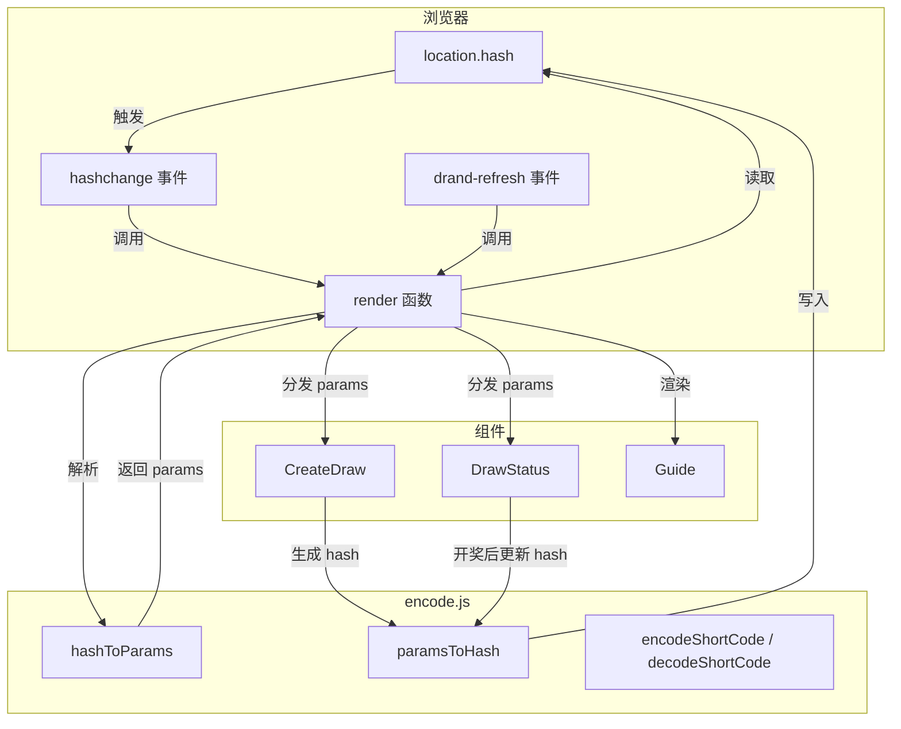

# 前端路由与状态管理

整个 drand-draw 应用是一个**纯前端 SPA**，部署在 Cloudflare Pages 上，没有任何后端服务器。这意味着路由、状态、参数传递全部依赖浏览器端机制。本文将逐层拆解这一架构的核心：基于 URL Hash 的路由器、参数编解码管道、以及无状态（stateless）的页面刷新策略。

---

## 三路由架构

`main.js` 中定义的 `render()` 函数是唯一的页面渲染入口。它通过读取 `location.hash` 来匹配三条路由：

| Hash | 路由名 | 功能 | 渲染组件 |
|---|---|---|---|
| `#/create` | 发起抽奖 | 表单：选择链、设置截止时间、参与人数、奖项 | `renderCreateDraw` |
| `#/verify` | 验证抽奖 | 输入短码或手动填写参数后验证 | `renderDrawStatus`（或 `renderManualVerify`） |
| `#/guide` | 使用说明 | 渲染 Markdown 文档 | `renderGuide` |

此外，`#/?chain=...&deadline=...&n=...` 这种带参数的 hash 会被识别为抽奖详情页，直接渲染 `renderDrawStatus`。这意味着你可以把抽奖参数的完整 URL 分享给任何人，打开即见结果页面。

路由匹配逻辑位于 `render()` 函数的开头的条件判断链：

```js
const h = hash.startsWith('/') ? hash : '/'
if (h === '/create') activeTab = 'create'
else if (h === '/guide') activeTab = 'guide'
else if (h === '/verify' || !hash || hash === '/' || hash.startsWith('/?') || params) activeTab = 'verify'
```

[来源](src/main.js#L10-L43)

三个路由切换按钮（`.tab-btn`）的点击事件通过修改 `location.hash` 触发导航，而非直接调用渲染函数：

```js
btn.addEventListener('click', () => {
  if (tab === 'create') location.hash = '#/create'
  else if (tab === 'verify') location.hash = '#/verify'
  else if (tab === 'guide') location.hash = '#/guide'
})
```

[来源](src/main.js#L59-L66)

这利用了接下来要讲的 Hash Change 事件机制。

---

## 从 Hash 中解析参数：`hashToParams`

任何包含抽奖参数的 URL 都以 `#/?key=value` 的格式编码。`hashToParams` 函数（位于 `encode.js`）负责将这些 query-string 格式的 hash 解析为结构化的参数对象。

解析流程分四步：

1. **清理前缀**：去掉开头的 `#`、`/`、`?` 符号，只保留 `key=value` 部分。
2. **URLSearchParams 解析**：将键值对解构为普通对象。
3. **类型转换**：`deadline` 和 `n` 转为整数，`prizes` 和 `winners` 按逗号分割后逐项转整数。
4. **有效性校验**：如果缺少 `chain`、`deadline`、`n` 中任一字段，则返回 `null`。

除了 query-string 格式，`hashToParams` 还支持从 hash 中提取短码：

```js
if (h.startsWith('verify/')) {
  const code = h.slice(7)
  return decodeShortCode(code)
}
```

这让 `https://drand-draw.pages.dev/#/verify/q-123abc-1e` 这种 URL 能直接定位到对应抽奖。

[来源](src/encode.js#L44-L79)

关于短码的完整编码规范，参见 [短码编解码规范](短码编解码规范.md)；关于 `smartParse` 从任意文本中自动识别参数的能力，参见 [智能解析引擎](智能解析引擎.md)。

---

## `hashchange` 事件监听：天然的路由器

`main.js` 最后两行是应用的路由"引擎"：

```js
window.addEventListener('hashchange', render)
window.addEventListener('drand-refresh', render)
```

[来源](src/main.js#L131-L132)

`hashchange` 是浏览器原生事件，当 `location.hash` 发生任何变化时自动触发。这意味着：

- 点击标签按钮修改 `location.hash` → 触发 `hashchange` → 重新执行 `render()`
- 用户手动在地址栏输入 hash → 触发 `hashchange` → 重新执行 `render()`
- 浏览器前进/后退按钮改变 hash → 触发 `hashchange` → 重新执行 `render()`

整个应用的路由依赖这一个事件驱动，无需任何第三方路由库。每次 `render()` 调用都会完全重写 `#app` 的 innerHTML，同时所有事件监听器在新 DOM 上重新绑定。

这种"全量重渲染"模式在小型 SPA 中是合理的：页面结构轻量（仅有四个组件），且每次渲染耗时在毫秒级。

---

## `drand-refresh` 自定义事件：截止时间自动刷新

倒计时功能由 `DrawStatus.js` 中的 `startCountdown` 函数驱动。当倒计时归零时，它不直接调用渲染逻辑，而是派发一个自定义事件：

```js
if (remaining <= 0) {
  clearInterval(window._countdownInterval)
  window.dispatchEvent(new CustomEvent('drand-refresh'))
  return
}
```

[来源](src/components/DrawStatus.js#L113-L117)

这个事件被 `main.js` 中的 `window.addEventListener('drand-refresh', render)` 捕获，触发页面重新渲染。重新渲染时，由于当前时间已超过 `deadline`，状态机进入"截止时间已到"状态（`isExpired === true`），页面自动从倒计时模式切换为"等待开奖"模式。

整个流程无需用户手动刷新页面，也不需要轮询服务器：

```mermaid
flowchart LR
    A[倒计时运行] --> B{剩余时间 ≤ 0?}
    B -- 否 --> A
    B -- 是 --> C[dispatchEvent drand-refresh]
    C --> D[render 重新执行]
    D --> E[isExpired === true]
    E --> F[渲染"等待开奖"界面]
```

这种设计利用了浏览器端的时间判断，完全避免了后端定时任务或 WebSocket 连接。

关于三态页面的完整流转（倒计时 → 等待开奖 → 已开奖），参见 [三态页面渲染机制](三态页面渲染机制.md)。

---

## 状态管理：Hash 即状态

这个应用没有传统的状态管理库（Vuex、Redux 等），也没有任何中央状态对象。**整个应用的状态完全编码在 URL Hash 中**。

状态管理的核心原则只有一条：

> 任何时候刷新页面，`render()` 从 `location.hash` 中恢复所有信息，页面完全回到之前的状态。

这意味着：

- **无需 localStorage** 来持久化抽奖参数（语言偏好除外，通过 `localStorage` 存储）。
- **无需服务端 session**，参数天然可分享。
- **无需状态同步**，多标签页打开同一 URL 看到完全一致的结果。

唯一例外的是倒计时定时器（`window._countdownInterval`），它只是 UI 层面的瞬时副作用，不构成"状态"。当页面因任何原因重新渲染时，倒计时会被清除并重新启动。

[来源](src/components/DrawStatus.js#L109-L131)

创建抽奖后生成的结果链接格式为：

```
#/?chain=quicknet&deadline=1728000000&n=500&prizes=3,1
```

这个 hash 包含参与者理解抽奖所需的全部信息：使用哪条 drand 链、截止时间戳、总参与人数、奖项层级。验证时只需要再加上 `&winners=42,137,289` 参数即可。

[来源](src/encode.js#L92-L100)

---

## 架构全景

将本文内容放入整个系统架构中来看：



这个循环清晰地展示了**URL 既是输入也是输出**——应用从 URL 读取状态，处理完毕后又将新状态写回 URL，构成一个闭环。

关于整体架构的更多细节，参见 [系统架构全景](系统架构全景.md)。

---

## 与其他页面的关联

- **创建抽奖**（`/#/create`）的表单中集成了 `renderSortTool`——参见 [候选列表排序与导出](候选列表排序与导出.md)
- `hashToParams` 处理的参数最终会落入 `DrawStatus` 组件——参见 [三态页面渲染机制](三态页面渲染机制.md)
- 从 hash 中解析出的 `chain` 值会传递给 `fetchBeacon`——参见 [drand API 集成与故障切换](drand-api-集成与故障切换.md)
- 短码编码解码的具体格式，参见 [短码分享机制](短码分享机制.md)