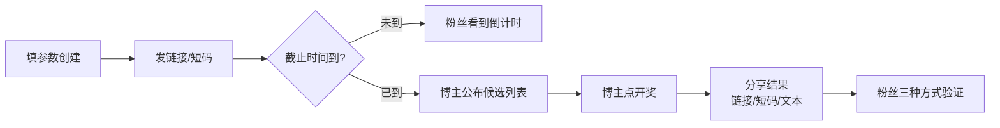

以下是面向初学者的博主操作指南。

---

# 博主操作指南

## 一次抽奖的生命周期

如果用一句话概括这个工具：**你设定规则 → 发链接 → 粉丝参与 → 截止时间到 → 用同一个链接开奖 → 把结果分享出去，任何人都能验证真伪。**

一次完整的抽奖分为三个阶段，下面逐一说明。

---

## 阶段一：创建抽奖并宣布

### 打开页面，填写表单

访问 [drand-draw.pages.dev](https://drand-draw.pages.dev)，点击「发起抽奖」，你会看到一张表单。每个字段的含义如下：

| 字段 | 说明 | 注意事项 |
|------|------|----------|
| **drand 网络** | 选择用哪条随机数链 | 推荐 **QuickNet**（3 秒出一轮随机数，截止后几乎无需等待） |
| **参与人数 N** | 你预期有多少人参与 | 最大 `1,048,575`，填写一个合理的整数即可 |
| **截止时间** | 精确到分钟 | 必须填未来时间，选对时区（中国用户选 UTC+8） |
| **奖项** | 可添加多层奖项 | 默认一等奖 1 人；点「+」可加二等奖、三等奖等 |

drand 网络有三条可选，它们的区别只有出块速度——不影响安全性：

- **QuickNet**（推荐）：3 秒一轮，开奖几乎秒出
- **Default**：30 秒一轮，开奖最多等 30 秒
- **EVMNet**：3 秒一轮，用于以太坊生态兼容场景

[来源](src/components/CreateDraw.js#L11-L37)，[来源](src/chains.js#L1-L40)

### 点击「生成抽奖链接」

填好后点击 **生成抽奖链接**，页面会展示两条信息：

1. **🔗 链接**（完整 URL）—— 粉丝点开即用
2. **🔢 短码**（如 `q-66364280-2s-1`）—— 怕社交平台限流外链时使用

两者包含的信息完全一样，只是形式不同。短码更短，不会触发平台的外链审查；链接更方便，点开自动加载。

[来源](src/components/CreateDraw.js#L86-L115)

### ⚠️ 关键：必须在截止时间**前**发布链接

这条非常重要。如果截止后再发布链接，粉丝无法确认 deadline 是否被篡改过——因为你可以在截止后重新生成一个 deadline 更晚的链接。**只有截止前公开的链接，才能锁定 deadline 不被更改。**

> 把链接或短码直接发在你的抽奖推文中。粉丝点开后会看到倒计时和截止时间，与你的推文互相印证。

[来源](dist/GUIDE.md#L43-L48)

---

## 阶段二：截止后公布候选列表

截止时间到了，你需要做以下几步：

### 1. 收集参与者

整理所有有效参与者的用户名（如 `@user1`、`@user2`……）。如果你在 X/Twitter 上办抽奖，可以用 Grok 直接拉取评论用户列表，命令很简单：*"列出这条帖子的所有评论用户"*。

### 2. 去重与排序

- 同一用户多次互动只计一次
- 将所有用户名按 **ASCII 码升序排列**（数字 → 大写字母 → 小写字母，如 `"0" < "9" < "@" < "A" < "Z" < "_" < "a" < "z"`）
- 从 `0` 开始依次编号

### 3. 使用候选列表排序工具

在「发起抽奖」页面的最下方，有一个 **候选列表排序工具**。你只需把用户名列表粘贴进去（支持空格、逗号、换行分隔），它自动完成排序和编号，并支持：

- 一键复制排序后的文本
- 导出为图片（「一行一列」或「尽量正方形」两种布局）

具体用法详见 [候选列表排序与导出](候选列表排序与导出.md)。

[来源](src/components/CreateDraw.js#L136-L137)

### ⚠️ 关键：开奖前必须公开排序后的候选列表

**在你点击「开奖」按钮之前，必须把完整的编号列表公开发布。** 这样粉丝可以核对：

- 自己的用户名是否在列表中
- 自己是否被正确编号
- 有没有自己被遗漏

如果有人发现不在列表上，此时应提出异议。一旦开奖，中奖编号就不可逆了。

[来源](dist/GUIDE.md#L76-L82)

---

## 阶段三：开奖与分享结果

### 使用**同一个链接**开奖

打开阶段一生成的那个**同一个链接**。不要新建、不要重新生成——同一组参数只能算出一个结果，换链接等于篡改参数。

此时页面会显示「等待开奖」状态，点击 **开奖** 按钮：

1. 页面自动从 drand 网络获取对应 round 的随机数
2. 使用 SHA-256 哈希派生种子，计算每个奖位的中奖编号
3. 若遇到碰撞（两个奖位算出同一个编号），自动顺延到下一个未占用编号

开奖过程通常只需几秒（QuickNet 链）。如果 drand 网络暂时不可用，页面会自动切换到备用节点。

[来源](src/components/DrawStatus.js#L83-L100)，[来源](src/components/DrawStatus.js#L108-L127)

### 结果分享的三种方式

开奖完成后，页面提供三个分享选项，你可以任选其一或全部发布：

| 方式 | 内容 | 适用场景 |
|------|------|----------|
| **🔗 链接** | 包含完整参数和中奖结果的 URL | 粉丝点开即可验证，最方便 |
| **🔢 短码** | 如 `q-66364280-2s-1-2a,f` | 短码不怕外链限流，粉丝到网站输入即可验证 |
| **📋 验证文本** | 纯文本格式，含所有参数和随机数 | 复制到社交平台，即使没链接也能手动验证 |

验证文本的内容示例如下：

```
chain: quicknet
deadline: 2026-05-06 12:53 UTC
round: #7398878
N: 100
randomness: a3f25c8d1e...
winners: 42, 15, 78, 43
verify: https://drand-draw.pages.dev/#/...
code: q-66364280-2s-1-2a,f,4e
```

[来源](src/components/DrawStatus.js#L129-L180)

### 粉丝如何验证

粉丝可以通过三种方式验证结果的真伪，详见 [粉丝验证指南](粉丝验证指南.md)：

1. **点链接**：直接打开你发的链接，页面自动验证并显示 ✅ 或 ❌
2. **输短码**：打开网站，粘贴短码，自动解析验证
3. **手动输入**：如果没有链接也没有短码，直接输入 chain、round、N、中奖编号也能验证

---

## 完整流程速览



---

## 常见操作提醒

### ✅ 必须做的事

- **截止前**发布链接
- **开奖前**公开排序后的完整候选列表
- 用 **同一个链接** 开奖（不要中途换参数）

### ❌ 常见的误解

- **"我可以先看到随机数再选 round"** → 不行，round 由截止时间锁定，deadline 在链接中公开
- **"对 A 说 N=100，对 B 说 N=200"** → 不行，N 在链接中，所有人看到同一个数
- **"多开几次直到满意"** → 不行，同一个 deadline 只能算出一个结果

### 💡 推荐配置

- **drand 网络**：QuickNet（开奖最快）
- **收集参与者**：用 Grok 自动拉取 X 评论用户列表
- **排序工具**：用页面自带的排序工具，自动按 ASCII 升序编号

---

## 推荐阅读

- [候选列表排序与导出](候选列表排序与导出.md) — 排序工具的详细用法与图片导出
- [粉丝验证指南](粉丝验证指南.md) — 面向参与者的三种验证方式
- [快速开始](快速开始.md) — 5 分钟跑通完整流程
- [系统架构全景](系统架构全景.md) — 理解为什么不需要后端也能实现可验证抽奖
- [短码分享机制](短码分享机制.md) — 短码如何绕过社交平台外链限流