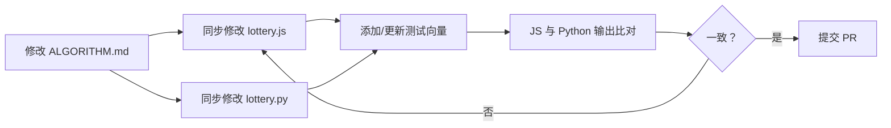

现在开始编写页面。

---

# 参与贡献指南

欢迎来到 drand-draw 项目。这是一个由 JavaScript 网页版和 Python CLI 版组成的双平台可验证抽奖工具。核心抽奖算法在两个平台上必须产生**完全一致的输出**——这是本项目的根本约束，也是贡献者最需要理解的架构决策。

---

## 项目架构概览

项目由两套独立的实现组成，共享同一套算法规范：

```
drand-draw/
├── src/                    ← 前端 (JavaScript, ES Modules)
│   ├── lottery.js          ← 抽奖核心算法
│   ├── encode.js           ← 短码编解码
│   ├── api.js              ← drand HTTP API
│   ├── chains.js           ← 链配置
│   └── main.js             ← 应用入口
│
├── cli/drand_draw/         ← CLI (Python)
│   ├── lottery.py          ← 抽奖核心算法 (与 lottery.js 一致)
│   ├── encode.py           ← 短码编解码
│   ├── api.py              ← drand HTTP API
│   └── __main__.py         ← argparse CLI 入口
│
└── ALGORITHM.md             ← 算法规范（源文档）
```

[来源](README.md#L49-L67)

前端和 CLI 共享同一个算法规范文件 `ALGORITHM.md`。任何算法修改都必须**三处同步**：规范文档、JavaScript 实现、Python 实现。关于整体架构的更多说明，参见 [系统架构全景](系统架构全景.md)。

---

## 第一原则：算法一致性

**这是本项目最重要的贡献规则。** 网页版 (`src/lottery.js`) 和 CLI 版 (`cli/drand_draw/lottery.py`) 的抽奖算法必须始终产生相同的输出。

确保一致性的方式不是"让人脑记住两处代码要一致"，而是**让两处代码各自独立实现同一个可验证的规范**。规范文件 `ALGORITHM.md` 是唯一权威来源。

### 核心算法对照

| 算法步骤 | JavaScript (`lottery.js`) | Python (`lottery.py`) |
|----------|--------------------------|----------------------|
| Round 计算 | `Math.floor(elapsed / period) + 1` | `math.floor(elapsed / period) + 1` |
| 种子派生 | `SHA256(randomness + ':' + shift)` via `crypto.subtle.digest` | `hashlib.sha256(...).hexdigest()` |
| 大整数取模 | `BigInt('0x' + seedHex) % BigInt(n)` | `int(seed_hex, 16) % n` |
| 碰撞处理 | `(idx + 1) % n` (环形) | `(idx + 1) % n` (环形) |
| 碰撞上限检查 | `attempts >= n` 抛错 | `attempts >= n` 抛错 |

[来源](src/lottery.js#L1-L56) · [来源](cli/drand_draw/lottery.py#L1-L39)

### 如何验证一致性

修改后，用相同的输入分别在两个平台上运行，比对输出：

```bash
# JavaScript (在浏览器 DevTools 中)
import { computeWinners } from './src/lottery.js'
// 用固定 randomness 测试

# Python
python3 -c "
from drand_draw.lottery import compute_winners
print(compute_winners('a3f25c...', 100, [1, 3]))
"
```

关于算法细节的完整说明，参考 [抽奖核心算法](抽奖核心算法.md) 和 [算法规范与测试向量](算法规范与测试向量.md)。

---

## 代码风格规范

项目没有强制的 lint 配置，但有以下约定：

### JavaScript (前端)

- **ES Modules**：使用 `export` / `import` 语法，项目中 `package.json` 已声明 `"type": "module"`。
- **async/await**：所有异步操作（drand API 调用、密码学操作）使用 `async/await`，避免 Promise 链式回调。
- **BigInt**：处理大整数使用 `BigInt` 字面量和 `Number()` 转换，注意 `BigInt` 与 `Number` 之间的隐式转换可能导致精度丢失。
- **Web Crypto API**：SHA-256 使用 `crypto.subtle.digest('SHA-256', ...)`，这是浏览器原生接口。
- **分号**：代码中使用了分号结尾，保持一致性。

[来源](src/lottery.js#L1-L56) · [来源](src/encode.js#L1-L115) · [来源](package.json#L2)

### Python (CLI)

- **argparse**：CLI 入口使用标准库 `argparse`，子命令通过 `subparsers` 实现。
- **类型提示**：函数参数和返回值建议添加类型提示（当前代码库中未强制）。
- **标准库优先**：优先使用 Python 标准库（`hashlib`、`urllib`、`math`），避免引入外部依赖。
- **异常类型**：输入验证抛 `ValueError`，运行时错误抛 `RuntimeError`。

[来源](cli/drand_draw/__main__.py#L1-L141) · [来源](cli/drand_draw/lottery.py#L1-L39)

### 通用

- **蛇形命名 vs 驼峰命名**：Python 模块使用蛇形命名（`compute_winners`），JS 模块使用驼峰命名（`computeWinners`），这是各自语言的惯例，不需要统一。
- **短码编解码**：JS 和 Python 的 `encode` 模块功能完全对应，函数签名和返回值结构保持一致。
- **链配置**：三条 drand 链的配置（genesis、period、hash）在两个平台中分别硬编码，必须同步更新。

关于短码编解码的详细规范，参考 [短码编解码规范](短码编解码规范.md)。

---

## 测试要求

### 当前状态

项目目前**没有独立的测试框架或测试文件**。正确性验证依赖于：

1. **确定性测试向量**：`ALGORITHM.md` 中提供的测试向量（固定输入 + 期望输出）
2. **手工比对**：在浏览器和终端分别运行代码，对比输出

### 贡献者的测试责任

每当你修改算法相关代码，必须：

1. **提供测试向量**：至少一组确定性的输入输出对（固定 `randomness`、`N`、`prizeTiers`），确保两个平台都能独立验证。
2. **测试样式**：测试向量应采用以下格式：

```python
# Python 测试向量示例
def test_compute_winners():
    randomness = "a3f25c8d1e7b9f4c2d8e0f1a3b5c7d9e0f2a4b6c8d0e1f3a5b7c9d1e3f5a7b9"
    n = 100
    prize_tiers = [1, 3]
    expected = [42, 15, 78, 43]  # 确定性期望结果

    result = compute_winners(randomness, n, prize_tiers)
    assert result == expected, f"got {result}"
```

3. **跨平台验证**：JS 和 Python 两端都必须通过同一组测试向量。

### 确定性测试向量的意义

drand 随机数是实时获取的，但算法本身是纯确定性的。测试向量使用固定的 `randomness` 十六进制字符串，不依赖任何外部 API 调用，可以在离线环境下运行，确保算法实现不出偏差。

---

## 修改流程

当你需要修改抽奖算法、短码格式或任何影响最终输出的逻辑时，请遵循以下流程：



### 步骤详解

**第一步：更新规范（ALGORITHM.md）**

`ALGORITHM.md` 是项目唯一的算法权威文档。先改它，再改代码。这确保规范变更**先于**实现变更，避免实现偏离规范。

[来源](ALGORITHM.md#L1-L5)

**第二步：同步修改两个实现**

- `src/lottery.js` — 前端实现
- `cli/drand_draw/lottery.py` — CLI 实现

如果修改涉及短码格式，还需同步：
- `src/encode.js` — 前端编解码
- `cli/drand_draw/encode.py` — CLI 编解码

[来源](src/lottery.js#L1-L56) · [来源](cli/drand_draw/lottery.py#L1-L39)

**第三步：添加测试向量**

在 `ALGORITHM.md` 的"测试向量"章节更新示例，确保新的测试向量涵盖了你的修改。测试向量应是**确定性**的——不依赖 drand 实时 API，使用硬编码的输入。

**第四步：跨平台验证**

用同一组输入在两个平台上运行，比对完整输出。特别注意边界情况：
- 碰撞场景（多个奖位算出相同编号）
- N 的最小值（1）和最大值（1,048,575）
- 奖项层级数达到上限（15 层）
- 每层人数达到上限（1,000 人）

关于安全边界的完整说明，参考 [安全边界与参数限制](安全边界与参数限制.md)。

---

## 开发环境

### 前端

```bash
# 安装依赖
npm install

# 启动开发服务器（热更新）
npm run dev

# 构建生产版本
npm run build

# 预览构建产物（模拟生产环境）
npm run preview
```

[来源](package.json#L3-L7)

前端基于 **Vite 6** 构建，使用 **Tailwind CSS v4**。开发服务器默认运行在 `http://localhost:5173`。

`npm run dev` 提供热更新，适合日常开发；`npm run preview` 构建并预览生产版本，适合在提交前做最终检查。

### CLI

```bash
cd cli

# 安装
pip install .

# 或者直接运行（无需安装）
python -m drand_draw verify --help
```

[来源](cli/README.md#L9-L18)

CLI 基于 Python 3.10+，使用标准库，无外部依赖。

### 部署

```bash
# 前端部署到 Cloudflare Pages
wrangler pages deploy ./dist --project-name drand-draw

# CLI 发布到 PyPI
cd cli && python -m build && twine upload dist/*
```

部署的详细说明见 [Cloudflare Pages 部署](cloudflare-pages-部署.md) 和 [CLI 打包与发布](cli-打包与发布.md)。

---

## 提交 PR 的检查清单

提交代码前，逐项确认：

- [ ] JS 和 Python 的核心算法输出一致（用同一组输入比对）
- [ ] `ALGORITHM.md` 已同步更新
- [ ] 测试向量已更新（至少包含一组确定性输入/输出）
- [ ] 短码编解码（如有修改）在两个平台保持一致
- [ ] 链配置参数（如有修改）在 `src/chains.js` 和 `cli/drand_draw/encode.py` 中同步
- [ ] 边界情况已测试（N=1、碰撞场景、奖项层级上限）
- [ ] `npm run build` 无报错
- [ ] CLI `python -m drand_draw <command> --help` 正常

---

## 推荐阅读

继续深入了解项目各模块的设计：

- [抽奖核心算法](抽奖核心算法.md) — 算法原理的深度解析
- [算法规范与测试向量](算法规范与测试向量.md) — 如何用测试向量验证正确性
- [系统架构全景](系统架构全景.md) — 项目整体架构设计
- [短码编解码规范](短码编解码规范.md) — 短码格式的完整规范
- [项目路线图与开发计划](项目路线图与开发计划.md) — 未来规划与已完成功能

---

## 代码来源索引

本文引用的关键代码文件：

| 文件 | 用途 |
|------|------|
| `src/lottery.js` | 前端抽奖算法 |
| `cli/drand_draw/lottery.py` | CLI 抽奖算法 |
| `src/encode.js` | 前端短码编解码 |
| `cli/drand_draw/encode.py` | CLI 短码编解码 |
| `cli/drand_draw/__main__.py` | CLI argparse 入口 |
| `src/api.js` | 前端 drand API 封装 |
| `cli/drand_draw/api.py` | CLI drand API 封装 |
| `src/chains.js` | 前端链配置 |
| `src/main.js` | 前端路由入口 |
| `package.json` | 前端构建配置 |
| `cli/pyproject.toml` | CLI 包配置 |
| `ALGORITHM.md` | 算法规范文档 |