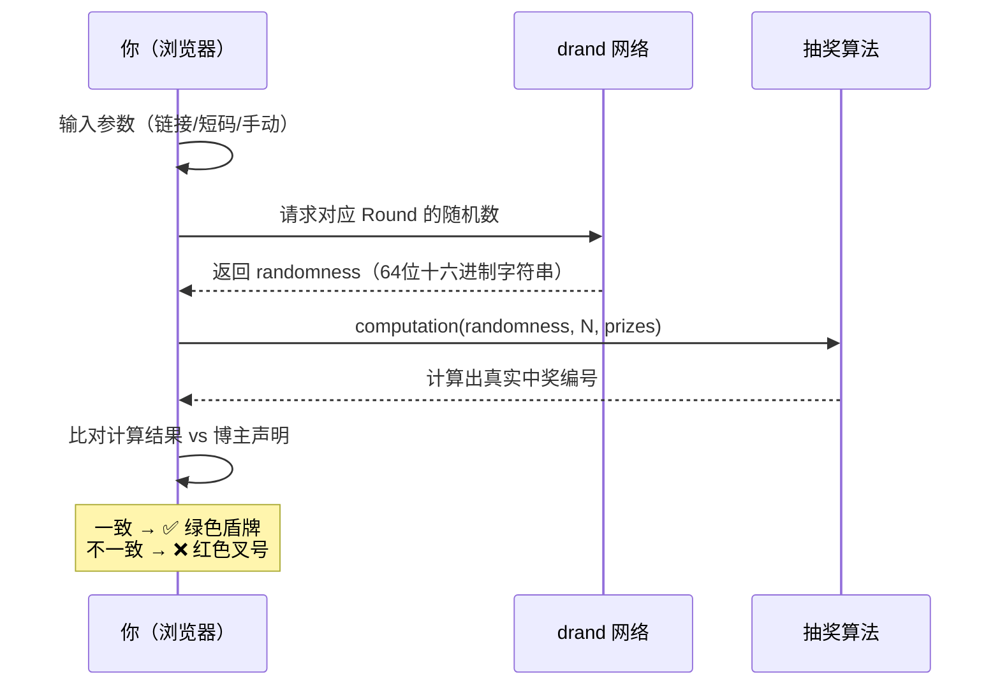

# 粉丝验证指南

参与抽奖后，你最关心的问题一定是：**开奖结果是真的吗？博主有没有作弊？** 你不需要信任任何人——只需要打开一个页面，花 10 秒钟验证。

这个工具的核心承诺是：**任何人都可以用同一套参数，自己动手验证结果的真伪**。验证过程不需要下载任何软件，不需要连接钱包，甚至不需要联网等待太久。下面三种方式，选一种你习惯的就行。

---

## 方式一：点开链接，自动验证

这是最省力的方式。博主公布结果时通常会附带一个链接，例如：

```
https://drand-draw.pages.dev/#/?
chain=quicknet&deadline=1767225600&n=100&prizes=1&winners=42
```

你只需要**在浏览器中打开这个链接**。页面会做三件事：

1. 自动从 **drand 去中心化随机信标网络** 获取对应 Round 的真实随机数
2. 用这个随机数重新计算中奖编号
3. 将计算结果与博主声明的中奖编号比对

所有步骤都在你本机的浏览器中执行，不经过任何服务器。验证完成后，你会看到以下两种结果之一。

[来源](src/components/DrawStatus.js#L19-L49) ｜ [来源](src/components/DrawStatus.js#L75-L119)

### 验证通过 ✅ — 绿色盾牌

```
🛡️ 验证通过
计算结果与声明一致，抽奖结果真实有效
```

页面顶部显示 **绿色盾牌图标**（`ICONS.shieldCheck`）和粗体文字 **"验证通过"**（`verifySuccess`），下方列出博主声明的中奖编号与计算结果完全一致，一个不多一个不少。

[来源](src/components/DrawStatus.js#L108-L131) ｜ [来源](src/i18n.js#L39-L40)

### 验证失败 ❌ — 红色叉号

```
✗ 验证不通过
计算结果与声明不一致，请核对输入信息
```

页面顶部显示 **红色叉号图标**（`ICONS.xIcon`）和粗体文字 **"验证不通过"**（`verifyFail`），同时分别展示"声明的中奖编号"和"实际计算结果"——两者对不上，说明博主公布的名单有问题。

[来源](src/components/DrawStatus.js#L131-L148) ｜ [来源](src/i18n.js#L39-L40)

---

## 方式二：在验证页输入短码

如果博主公布的是一串短码而不是完整链接（例如 `q-694a20-2s-1,2-12,2s`），你仍然可以验证。短码本质上是将抽奖参数压缩成了更短的字符串。

操作步骤：

1. 打开 https://drand-draw.pages.dev/
2. 点击顶部的 **"验证抽奖"** 标签页
3. 在输入框中 **粘贴短码或完整链接**（两种都支持）
4. 点击 **"验证"** 按钮

页面的智能解析引擎（`smartParse` 函数）会自动识别你粘贴的内容——无论是短码、URL 还是文本片段中嵌入的代码——提取出链、截止时间、参与人数和中奖编号等参数，然后执行验证。

你甚至可以直接按 **回车键** 触发验证，不需要点按钮。

[来源](src/main.js#L103-L120) ｜ [来源](src/main.js#L157-L173) ｜ [来源](src/main.js#L179-L195) ｜ [来源](src/encode.js#L68-L99)

关于短码的编码原理，请参考 [短码编解码规范](短码编解码规范.md) 和 [短码分享机制](短码分享机制.md)。

---

## 方式三：手动输入参数

如果你只有零散的几个数字——比如博主在帖子里写了 "QuickNet 链，Round #123456，N=100，赢家是 42 号"——也可以通过手动输入来验证。

在验证页面向下滑动，找到 **"手动输入"** 区域。你需要填写四项：

| 字段 | 说明 | 示例 |
|---|---|---|
| **链** | 使用的 drand 网络 | `quicknet`（建议默认选这个） |
| **Round 编号** | 截止时间对应的 drand 轮次 | `1234567` |
| **参与人数 N** | 候选列表总人数 | `100` |
| **声明的中奖编号** | 博主公布的赢家序号，多个用逗号分隔 | `42` 或 `42,15,78` |

填写完成后点击 **"验证"** 按钮，页面会从 drand 网络获取该 Round 的随机数，重新计算赢家并与你填写的中奖编号逐一比对。

[来源](src/main.js#L197-L225) ｜ [来源](src/main.js#L227-L243)

> **小提示：** 手动输入需要你知道 Round 编号。如果你只有截止时间戳，系统会自动计算 Round。Round 的计算公式是 `(deadline - genesisTime) / period + 1`，详见 [抽奖核心算法](抽奖核心算法.md)。

---

## 验证背后发生了什么？

三种方式的验证逻辑完全相同，只是输入参数的方式不同。核心流程可以用以下序列图表示：



关键点：**随机数由 drand 网络决定**，这是一个由 Cloudflare、Protocol Labs、以太坊基金会等 15+ 独立机构共同运行的公开服务，没有任何人或机构能操控其结果。而中奖编号的计算完全在你自己浏览器中执行，不依赖任何第三方。

[来源](src/lottery.js#L17-L40) ｜ [来源](src/api.js#L1-L17)

---

## 下一步

- 想了解抽奖结果是怎么算出来的？阅读 [抽奖核心算法](抽奖核心算法.md) 和 [算法规范与测试向量](算法规范与测试向量.md)
- 好奇短码是怎么编码的？查看 [短码编解码规范](短码编解码规范.md)
- 如果你是博主，想发起一场抽奖？阅读 [博主操作指南](博主操作指南.md) 或 [快速开始](快速开始.md)
- 想从系统层面理解验证的信任模型？阅读 [攻击面分析与信任模型](攻击面分析与信任模型.md)