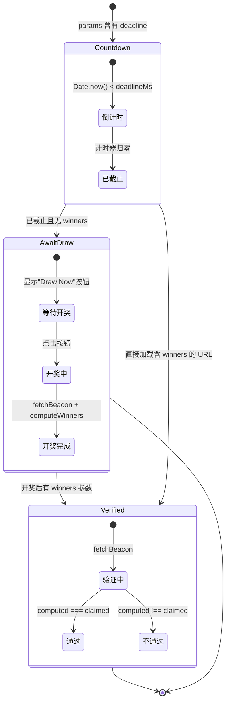

# 系统架构全景

## 架构概览

本项目是一个 **零后端、纯静态的单页应用**（SPA），部署于 Cloudflare Pages，所有状态编码在 URL 或短码中，不依赖任何数据库或服务器端运行时。

```
┌──────────────────────────────────────────────────────────────┐
│                     Cloudflare Pages                          │
│  ┌─────────────────────────────────────────────────────────┐  │
│  │                    index.html                            │  │
│  │  <script type="module" src="/src/main.js">              │  │
│  └────────────────────────┬────────────────────────────────┘  │
│                           │                                    │
│  ┌────────────────────────▼────────────────────────────────┐  │
│  │                    main.js                                │  │
│  │  ┌─────────────────────────────────────────────────────┐ │  │
│  │  │       Hash Router (location.hash → tab routing)     │ │  │
│  │  │  #/create  │  #/verify  │  #/guide  │  #/?chain=…  │ │  │
│  │  └────────────┼────────────┼───────────┼──────────────┘ │  │
│  └───────────────┼────────────┼───────────┼────────────────┘  │
│                  │            │           │                    │
│     ┌────────────┼────────────┼───────────┼────────────────┐  │
│     │            ▼            ▼           ▼                 │  │
│     │  CreateDraw.js   DrawStatus.js   Guide.js             │  │
│     │  (发起抽奖表单)    (三态页面)      (使用说明)          │  │
│     └──────────────────────────────────────────────────────┘  │
│                                                               │
│     ┌──────────────────────────────────────────────────────┐  │
│     │              核心模块                                 │  │
│     │  lottery.js  │  chains.js  │  encode.js  │  api.js  │  │
│     │  (抽奖算法)    (链配置)      (编解码)      (drand API)│  │
│     └──────────────────────────────────────────────────────┘  │
│                                                               │
│     ┌──────────────────────────────────────────────────────┐  │
│     │  支持模块                                              │  │
│     │  i18n.js  │  icons.js  │  style.css  │  SortTool.js │  │
│     │  (国际化)   │  (图标)    │  (样式)      │  (排序导出)  │  │
│     └──────────────────────────────────────────────────────┘  │
└──────────────────────────────────────────────────────────────┘

                     ┌──────────────────┐
                     │   CLI (Python)    │
                     │  drand_draw/      │
                     │  ├─ lottery.py   │ ← 与 lottery.js 算法一致
                     │  ├─ encode.py    │ ← 与 encode.js 算法一致
                     │  ├─ api.py       │ ← 与 api.js 逻辑一致
                     │  └─ __main__.py  │ ← CLI 入口
                     └──────────────────┘
```

[来源](index.html#L12-L14) | [来源](src/main.js#L1-L10) | [来源](cli/drand_draw/lottery.py#L1-L4)

---

## 入口与路由

### index.html → main.js

`index.html` 是 Cloudflare Pages 分发的唯一 HTML 文件。它加载 `/src/main.js` 作为 ES Module 入口，页面内容完全由 JavaScript 动态渲染，`<div id="app">` 作为挂载点。无 JavaScript 环境下显示 noscript 降级文档。[来源](index.html#L1-L21)

### Hash 路由

路由系统基于 `window.location.hash` 变化实现，无第三方依赖，见 `main.js:render()` 函数。哈希变化触发 `hashchange` 事件，进入路由分发：

| Hash 模式 | 激活 Tab | 对应组件 |
|-----------|----------|----------|
| `#/create` | 发起抽奖 | `CreateDraw.js` |
| `#/verify` 或空 | 验证抽奖（手动输入页） | 内联 `renderManualVerify` |
| `#/guide` | 使用说明 | `Guide.js` |
| `#/?chain=…&deadline=…&n=…` | 验证（直接解析参数） | `DrawStatus.js` |
| `#/verify/{短码}` | 验证（短码解码后） | `DrawStatus.js` |

热点路径：`render()` 函数首先将 hash 解析为参数对象（通过 `hashToParams`），再根据 hash 前缀确定 `activeTab`，最后渲染对应的组件内容。导航按钮通过 `location.hash` 赋值触发重新渲染。[来源](src/main.js#L15-L94)

### 无组件框架

项目不使用 React/Vue 等框架，而是采用轻量组件模式：每个组件暴露一个 `render(container, params)` 函数，将 innerHTML 写入容器 DOM 节点，事件绑定在渲染后通过 `querySelector` 挂接。详见 [组件系统与 UI 架构](组件系统与-ui-架构.md)。[来源](src/main.js#L109-L112)

---

## 三个 Tab 的职责划分

### CreateDraw.js — 发起抽奖表单

用户填写：drand 链选择、参与人数 N、截止时间（含时区选择）、奖项层级配置。表单底部内嵌了 `SortTool`（候选列表排序导出工具）。生成链路为：

1. `computeRound()` 根据 deadline 和链配置计算预期 round
2. `paramsToHash()` 生成 URL 格式 `#/?chain=quicknet&deadline=1715000000&n=100&prizes=1,3`
3. `encodeShortCode()` 生成短码格式 `q-66364280-2s-1,3`

[来源](src/components/CreateDraw.js#L1-L25)

### DrawStatus.js — 三态页面

这是系统最核心的组件，根据时间轴自动切换三种状态（详见下文"三态页面模型"）。同时支持两种数据来源：`{chain, deadline, n, prizes}`（基于时间）和 `{chain, round, n, prizes, winners}`（基于 round 号）。[来源](src/components/DrawStatus.js#L21-L49)

### Guide.js — 使用说明与攻击面分析

渲染中英双语的使用指南，包括排序规则声明、攻击面分析、手动验证步骤。这部分内容在 [概览](概览.md) 和 [博主操作指南](博主操作指南.md) 中有更详细的展开。[来源](src/main.js#L98-L99)

---

## 三态页面模型

这是 `DrawStatus` 组件最核心的设计——**同一 URL 在不同时间点呈现不同状态**，所有逻辑由客户端驱动，无需服务端介入。



### 状态 1 — 截止前倒计时

`renderCountdown()` 渲染完整的倒计时面板，显示：
- 截止时间（ISO UTC）
- 预期使用的 drand round 号（`Math.floor((deadline - genesis) / period) + 1`）
- 奖项配置
- 参与人数 N

倒计时由 `setInterval` 每秒更新，归零时触发 `drand-refresh` 自定义事件，页面自动重新渲染。[来源](src/components/DrawStatus.js#L57-L97)

### 状态 2 — 已截止待开奖

`renderAwaitDraw()` 渲染"开奖"按钮。点击后：

1. 计算 round 号
2. 调用 `fetchBeacon()` 从 drand 网络获取 randomness（含 5 次自动重试）
3. 调用 `computeWinners()` 计算中奖结果
4. 将结果参数合并入 URL（`history.replaceState`）
5. 渲染结果面板：随机数、各奖项中奖编号、分享按钮

**关键设计**：开奖结果是确定性的——给定相同的 `randomness + prizeTiers + N`，任何人在任何时间调用 `computeWinners()` 都得到完全相同的结果。这意味着"谁点开奖都一样"。[来源](src/components/DrawStatus.js#L124-L214)

### 状态 3 — 已开奖验证

`renderVerified()` 渲染完整的验证面板。加载时自动：

1. 从 URL/短码中提取 `winners` 参数（claimed winners）
2. 计算 round 号
3. 调用 `fetchWithRetry()` 获取 drand 随机数
4. 调用 `computeWinners()` 重新计算
5. 比对 claimed vs computed，显示绿色"验证通过"或红色"验证不通过"

验证过程对用户完全透明：展示 randomness 原文、获奖编号推导过程、以及可复现的验证文本。[来源](src/components/DrawStatus.js#L216-L259)

### 三态的 URL 驱动机制

三种状态切换无需页面刷新，由 `params` 对象的字段驱动：

```
params.deadline + Date.now()        → 状态 1 (倒计时)
params.deadline 已过期, 无 winners  → 状态 2 (等待开奖)
params.deadline 已过期, 有 winners  → 状态 3 (验证通过)
params.round, 无 winners           → 按 round 查询
params.round, 有 winners           → 按 round 验证
```

详见 [三态页面渲染机制](三态页面渲染机制.md)。[来源](src/components/DrawStatus.js#L36-L49)

---

## 双平台算法一致性

项目同时提供 **浏览器端 JavaScript** 和 **命令行 Python CLI** 两种客户端，两者必须对同一组输入产生完全相同的结果。这是系统的信任基础。

### 一致性关键点

| 算法环节 | JS 实现 | Python 实现 | 一致性保证 |
|----------|---------|-------------|-----------|
| Round 计算 | `lottery.js:computeRound()` | `lottery.py:compute_round()` | 相同公式 `floor((deadline - genesis)/period) + 1` |
| 种子派生 | `lottery.js:deriveSeed()` — `SHA-256(randomness + ':' + shift)` | `lottery.py:_derive_seed()` — `sha256(f'{randomness}:{shift}'.encode())` | 相同拼接格式 + SHA-256 |
| 中奖计算 | `lottery.js:computeWinners()` — BigInt % N + 碰撞顺延 | `lottery.py:compute_winners()` — `int(seed, 16) % n` + 碰撞顺延 | 相同迭代顺序和碰撞策略 |
| 短码编码 | `encode.js:encodeShortCode()` — base36 | `encode.py:encode_short_code()` — 自定义 base36 | 相同编码规则 |
| 短码解码 | `encode.js:decodeShortCode()` | `encode.py:decode_short_code()` | 相同解析逻辑 |
| 智能解析 | `encode.js:smartParse()` | `encode.py:smart_parse()` | 相同 5 步尝试策略 |
| drand API | `api.js:fetchBeacon()` — 多 relay 故障切换 | `api.py` — 同逻辑 | 相同 relay 列表和 fallback 策略 |

[来源](src/lottery.js#L1-L44) | [来源](cli/drand_draw/lottery.py#L1-L34) | [来源](src/encode.js#L1-L80) | [来源](cli/drand_draw/encode.py#L1-L120)

### 测试向量

两平台共享同一套测试向量（定义在 `ALGORITHM.md` 文档中），通过已知输入-输出对验证实现正确性。所有新的算法变更必须同时更新两侧实现并通过向量校验。详见 [算法规范与测试向量](算法规范与测试向量.md)。[来源](ALGORITHM.md#L1-L10)

### 为何需要双平台

- **JS 版本**部署在 Cloudflare Pages，面向普通用户：博主创建抽奖、粉丝验证结果
- **Python CLI**面向深度用户和开发者：批量验证、自动化集成、离线验证、算法复现
- 双平台互为背书：任何一方出现 bug，另一方可作为参照验证

详见 [CLI 工具安装与基础用法](cli-工具安装与基础用法.md)。

---

## 数据流全景

### 创建抽奖

```
用户填表单 → CreateDraw.js → computeRound()
                              ↓
                    paramsToHash() → URL (#/?chain=…&deadline=…&n=…&prizes=…)
                    encodeShortCode() → 短码 (q-{deadline_hex}-{n_b36}-{prizes})
                                        ↓
                              用户复制链接/短码 → 发布到社交平台
```

### 开奖流程

```
用户打开链接 → main.js 路由 → DrawStatus.js
                              ↓
                    判断状态: deadline 已过 + 无 winners
                              ↓
                    用户点击"开奖"
                              ↓
                    api.js:fetchBeacon(chain, round)
                              ↓
                    drand API 返回 { randomness, signature }
                              ↓
                    lottery.js:computeWinners(randomness, n, prizes)
                              ↓
                    winners = [42, 15, 78, 33]
                              ↓
                    history.replaceState 更新 URL 添加 winners 参数
                    用户复制带结果的链接/短码 → 发布
```

### 验证流程

```
粉丝打开链接 → main.js 路由 → DrawStatus.js
                              ↓
                    判断状态: 有 winners 参数
                              ↓
                    自动 fetchBeacon() + computeWinners()
                              ↓
                    比对 claimed winners vs computed winners
                              ↓
                    显示 ✓ 验证通过 或 ✗ 验证不通过
```

---

## 安全架构：无后端的安全模型

系统不依赖任何后端，安全模型完全由 **算法约束 + 密码学原语** 保证：

| 攻击向量 | 防御机制 |
|----------|---------|
| 博主在知道 randomness 后选择 round | Round 由 deadline 唯一确定，deadline 锁定在 URL/短码中 |
| 博主对不同验证者说不同的 N | N 锁定在 URL/短码中，页面解码直接显示 |
| 博主篡改 drand 返回的随机数 | drand 随机数由 League of Entropy 多节点 BLS 签名 |
| 博主多次开奖直到满意 | 同一 URL 只能产出一个确定性的结果 |
| 博主使用不同的排序规则 | 排序规则由页面硬编码声明，博主无法否认 |

详见 [攻击面分析与信任模型](攻击面分析与信任模型.md)。[来源](PLAN.md#L22-L30)

---

## 推荐阅读

- [前端路由与状态管理](前端路由与状态管理.md) — Hash 路由的完整实现与参数编解码机制
- [三态页面渲染机制](三态页面渲染机制.md) — DrawStatus 组件的状态机细节
- [抽奖核心算法](抽奖核心算法.md) — Round 计算、种子派生、碰撞处理的完整数学描述
- [智能解析引擎](智能解析引擎.md) — smartParse 的五步解析策略
- [短码编解码规范](短码编解码规范.md) — 短码格式协议与跨平台实现
- [组件系统与 UI 架构](组件系统与-ui-架构.md) — 无框架下的组件化模式
- [Cloudflare Pages 部署](cloudflare-pages-部署.md) — Wrangler 部署配置