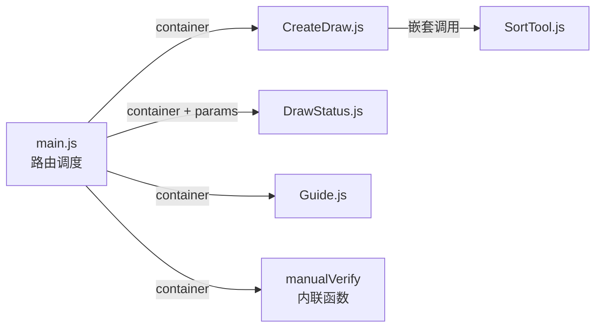
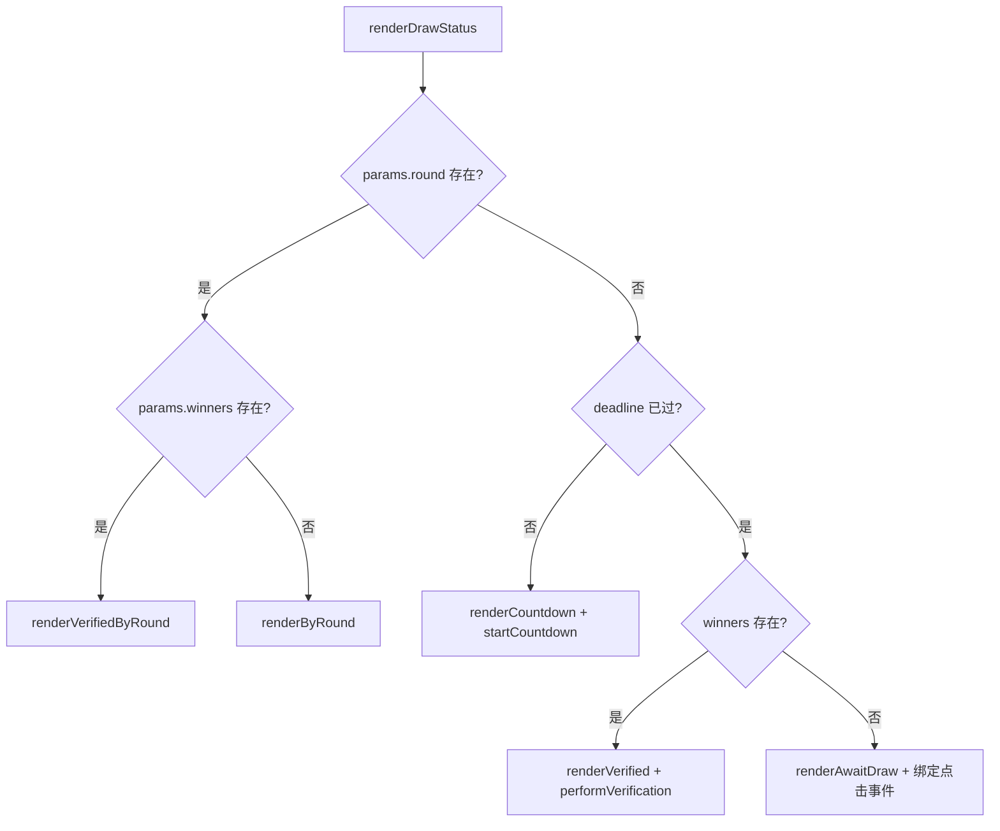
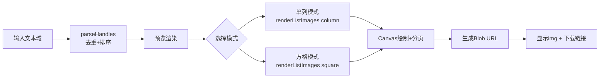

# 组件系统与 UI 架构

## 无框架的组件化方案

本项目是一个零依赖的纯前端 SPA，四个 UI 组件遵循统一的调用约定：**每个组件是一个独立的渲染函数，接受 `container`（DOM 元素）作为参数，函数内部负责构建 DOM 树并绑定事件**。没有虚拟 DOM，没有响应式状态管理库，没有模块联邦——只有导出的纯函数和手动的事件管理。



这种模式的核心契约可以概括为：

```
renderXxx(container: HTMLElement, ...data): void
```

组件不返回值，不维护实例引用，不暴露生命周期钩子。渲染是一次性的：每次导航切换都会调用 `app.innerHTML = '...'` 清空容器，然后重新调用对应的渲染函数。[来源](src/main.js#L16-L76)

---

## 组件剖析

### CreateDraw.js — 表单驱动的生成器

**职责**：提供一个完整的抽奖创建表单，收集链类型、参与者数量 N、截止时间、时区和奖项层级，计算预期 round，最后生成验证链接和短码。

**交互模式**：

1. **表单状态管理**——所有输入字段的当前值保存在 DOM 元素中，点击"生成"按钮时一次性读取。没有独立的状态对象。
2. **动态表单元素**——"添加奖项"按钮通过 `document.createElement` 动态创建新的输入行，每行附带一个删除按钮，删除后调用 `updatePrizeLabels()` 重新编号。[来源](src/components/CreateDraw.js#L95-L114)
3. **异步操作**——生成按钮的点击处理函数是 `async`，但内部没有远程调用（round 计算是纯函数），因此没有加载状态。
4. **结果展示**——生成后在同一容器内创建结果卡片，包含复制链接、复制短码、查看详情三个按钮。复制使用 `navigator.clipboard.writeText`，带 2 秒视觉反馈。[来源](src/components/CreateDraw.js#L126-L163)
5. **嵌套调用**——函数的末尾，它在同一容器内调用 `renderSortTool(sortContainer)`，将排序工具作为创建页面的附属功能嵌入。[来源](src/components/CreateDraw.js#L167-L168)

表单验证在点击时执行：检查 N 是否有效、截止时间是否在未来、奖项总数是否超过 N。[来源](src/components/CreateDraw.js#L116-L125)

---

### DrawStatus.js — 三态渲染引擎

**职责**：根据抽奖状态（未到期/已到期未开奖/已开奖）渲染三种不同的 UI，并驱动异步操作（倒计时、drand API 调用）。

这是四个组件中**最复杂**的一个，其内部状态机如下：



**三态详解**：

| 状态 | 触发条件 | 渲染函数 | 行为 |
|------|----------|----------|------|
| 倒计时 | `deadline` 未过期 | `renderCountdown` + `startCountdown` | 实时倒计时，到期后派发 `drand-refresh` 事件触发重渲染 |
| 等待开奖 | `deadline` 已过但无 winners | `renderAwaitDraw` | 显示"开奖"按钮，点击后异步调 drand API 获取 beacon，计算 winners，更新 URL |
| 验证结果 | 有 winners | `renderVerified` / `renderVerifiedByRound` | 立即调 drand API 验证 winners 一致性，显示通过/失败 |

**事件驱动机制**：

- `startCountdown` 使用 `setInterval` 每秒更新 DOM 中的文本节点，倒计时结束时 `clearInterval` 并 `dispatchEvent(new CustomEvent('drand-refresh'))`。[来源](src/components/DrawStatus.js#L83-L99)
- `renderAwaitDraw` 中的"开奖"按钮绑定 `async` 点击处理函数：调用 `fetchBeacon`（带重试），然后 `computeWinners`，最后更新 URL（`history.replaceState`）并渲染结果。[来源](src/components/DrawStatus.js#L131-L185)
- `performVerification` 和 `performVerificationByRound` 都是 `async`，使用 `fetchWithRetry` 封装了最多 5 次重试的 API 调用逻辑。[来源](src/components/DrawStatus.js#L1-L8)

**关键设计决策**：winners 的计算在**客户端**完成（`computeWinners`），服务端（drand）只提供不可篡改的随机数。这意味着"开奖"操作本质上是本地计算，任何人都可以独立验证。[来源](src/components/DrawStatus.js#L153-L156)

**覆写渲染**：`renderByRound` 和 `renderVerifiedByRound` 处理当 URL 中直接指定了 `round` 参数（而非 `deadline`）的情况，这对应于手动验证场景。[来源](src/components/DrawStatus.js#L222-L285)

---

### Guide.js — Markdown 渲染器

**职责**：加载并渲染用户指南文档（Markdown 格式），支持中/英文切换。

**实现细节**：

1. 从 `i18n.js` 的 `getLang()` 获取当前语言，决定加载 `/GUIDE.md` 还是 `/GUIDE_EN.md`。[来源](src/components/Guide.js#L5-L6)
2. 从 `markdown.js` 的 `getCachedMd(lang)` 获取已预取的内容。如果缓存未命中，显示一个 fallback 链接指向原始 Markdown 文件。[来源](src/components/Guide.js#L8-L10)
3. 使用 `mdToHtml(md)` 将原始 Markdown 转换为 Tailwind 风格的 HTML。这是**自实现的 Markdown 解析器**，支持：标题（h1-h4）、代码块、表格、引用、有序/无序列表、内联样式（`code`、**粗体**、链接）。[来源](src/markdown.js#L22-L141)

**预取策略**：`markdown.js` 的 `preFetchMd()` 在应用启动时（`main.js` 第一行）并行 fetch 中英两份 Markdown 文件，缓存到内存对象 `mdCache` 中。这样当用户切换到 Guide 页面时，内容立即可用。[来源](src/markdown.js#L9-L17)

这是一种**离线优先但并非 PWA** 的缓存模式——缓存仅在当前页面生命周期内有效。

---

### SortTool.js — Canvas 图像生成引擎

**职责**：对参与者列表排序、去重、编号，并生成为 PNG 图片，供博主在社交平台上发布。

**功能流程**：



**核心实现**：

- `parseHandles` —— 输入清洗：移除 `@` 符号，统一分隔符，去重，按字母排序。[来源](src/components/SortTool.js#L179-L189)
- `renderListImages(handles, mode)` —— 使用 `<canvas>` API 逐页绘制，支持两种排版模式：
  - **单列模式**：每页最多 `floor((8000 - 48 - 32) / 30)` ≈ 264 行，超出分页。
  - **方格模式**：根据参与者数量计算最优列数（`ceil(sqrt(N * cell_h / cell_w))`），每页最大高度 2000px，超出分页。
- 每页包含：渐变头部（标题 + 总数 + 页码）、交替行背景、行分隔线、尾部水印（`drand-draw.pages.dev`）。[来源](src/components/SortTool.js#L199-L283)
- 生成完成后的每个 `<canvas>` 通过 `canvas.toBlob()` 转为 PNG blob，创建 `ObjectURL` 插入页面，附带下载链接。[来源](src/components/SortTool.js#L159-L173)

**与 CreateDraw 的联动**：当用户在创建页面粘贴参与者列表时，SortTool 自动将 N 值同步到 CreateDraw 的 N 输入框。[来源](src/components/SortTool.js#L99)

---

## 路由调度

`main.js` 中的 `render()` 函数是应用的路由中心。它基于 `location.hash` 做条件分支：

```
#/create          → renderCreateDraw(mainContent)
#/verify[/code]   → smartParse 或 decodeShortCode → renderDrawStatus
#/guide           → renderGuide(mainContent)
#/?chain=xxx...   → hashToParams → renderDrawStatus
其他              → renderManualVerify (内联函数)
```

[来源](src/main.js#L77-L98)

路由切换有两种触发方式：

1. **用户点击**——导航栏的 tab 按钮通过修改 `location.hash` 触发 `hashchange` 事件。
2. **倒计时到期**——`DrawStatus.js` 的倒计时到期后派发自定义事件 `drand-refresh`，`main.js` 中监听该事件并重新调用 `render()`。[来源](src/main.js#L163-L164)

每次渲染都是**全量重建**：`app.innerHTML = '...'` 清空整个应用容器。这意味着所有 DOM 状态（输入框内容、滚动位置等）都会丢失，但这也确保了状态一致性——不存在"幽灵状态"。

---

## 设计哲学：函数式组件 vs. 框架组件

### 这种模式的优点

**1. 零依赖，极简心智模型**
每个组件就是一个函数，没有生命周期、没有 hook 规则、没有上下文。`renderCreateDraw` 被调用时渲染，调用结束后它的"实例"不复存在。新人阅读代码只需理解 JavaScript 和 DOM API。[来源](src/components/CreateDraw.js#L1-L4)

**2. 状态即 URL**
应用的"持久状态"完全编码在 URL hash 中。`DrawStatus` 的三态判定完全基于 `params` 对象（`deadline` vs. `round` vs. `winners` 的组合），不存在组件的内部状态与 URL 不同步的问题。[来源](src/components/DrawStatus.js#L31-L50)

**3. 测试简单**
每个渲染函数接受输入（`container` + 数据），输出是 DOM 的副作用。无需 mock 框架的渲染引擎。

**4. 内存安全**
没有组件实例的引用泄漏——每次路由切换都会 `innerHTML = ''`，旧的 DOM 和事件监听器一起被垃圾回收。

### 这种模式的缺点

**1. 全量重渲染**
每次路由切换重建整个 DOM 树。对于 `<select>`、`<input>` 等表单元素的临时状态（如用户已填写但未提交的内容），必须手动在重建后恢复——本项目中没有做这种恢复，这意味着切换到其他 tab 再切回来会丢失表单输入。

**2. 事件管理原始**
所有事件绑定都在渲染函数中手动完成。没有事件委托层，没有自动清理——`startCountdown` 的 `setInterval` 依赖全局变量 `window._countdownInterval` 来防止多重计时器。[来源](src/components/DrawStatus.js#L83-L84)

**3. 组件间通信隐式**
组件之间没有 props 或 events 管道。CreateDraw 通过 DOM 引用（`document.getElementById('create-n')`）直接读取另一个组件的输入值。[来源](src/components/SortTool.js#L99) 这种紧耦合在小型应用中可行，但规模扩大后难以维护。

**4. 无虚拟 DOM 优化**
每次 `innerHTML` 赋值都会触发浏览器的全量解析和重排。对于 DrawStatus 这种包含倒计时（每秒更新）的场景，本项目只更新单个文本节点而非整个组件，手动避免了性能陷阱。

---

## 作为对比：框架组件会怎么做

| 维度 | 本项目（函数式组件） | 典型框架（React/Vue） |
|------|-------------------|---------------------|
| 渲染 | `container.innerHTML = string` | 虚拟 DOM diff + patch |
| 状态 | URL hash + DOM 属性 | `useState` / `ref` |
| 事件 | 手动 `addEventListener` | 声明式 `onClick` |
| 生命周期 | 无 | `useEffect` / `onMounted` |
| 通信 | 全局变量 / DOM 共享 | props + events / 上下文 |
| 组件边界 | 函数 + 文件约定 | 框架原生支持 |

---

## 适用性评估

这种"函数式组件"模式非常适合以下场景：

- **UI 复杂度有限**（3-5 个独立页面）
- **状态主要来自外部**（URL、API 响应）
- **团队规模小**（单人或双人）
- **对包体积敏感**（本项目未压缩 JS 约 20KB gzip）

当应用增长到 10+ 个组件且有大量跨组件状态共享时，缺乏框架的约束力会成为瓶颈。

---

## 推荐阅读

- [三态页面渲染机制](三态页面渲染机制.md) —— 详解 DrawStatus 组件的状态机设计
- [前端路由与状态管理](前端路由与状态管理.md) —— hash 路由与参数编解码的完整实现
- [候选列表排序工具实现](候选列表排序工具实现.md) —— SortTool 的 Canvas 图像引擎深度解析
- [系统架构全景](系统架构全景.md) —— 整体架构中各组件的上下文